CI build and test:

Main: 

Advanced Multi-Surface Navigation for Unmanned Ground Vehicles (UGVs) Using 4D Path Planning Techniques (ugv_nav4d)
=============
A 4D (X,Y,Z, Theta) Planner for unmaned ground vehicles (UGVs).

<figure>

</figure>

## Statement of need
Accurate ground surface representation is crucial for ground-based robots in complex terrains. The [ROS2 Navigation Stack](https://docs.nav2.org/), which uses voxel maps for 3D navigation, often loses detail and accuracy, especially in multi-storey environments, due to its discrete voxelization and separate costmaps for each floor.

We propose ugv_nav4d, a path planner that enhances environmental representation with [Multi-Layered Surface Maps](https://github.com/envire/slam-maps) (MLS) and a 3D [Traversability Map](https://github.com/dfki-ric/traversability_generator3d.git). Ugv_nav4d avoids the "stepping" effect of voxel maps by using a continuous grid and detailed vertical information, providing smoother and more accurate terrain modeling.

Unlike nav2, ugv_nav4d simplifies planning with a single TraversabilityMap3D, which contains detailed ground surface data, offering a superior alternative to nav2’s 3D costmaps. For users, MLS maps provide a smoother, more realistic view of terrain compared to the blocky voxel maps, enhancing navigation and decision-making in complex environments.

## Installation

Follow the steps to peform a standalone build of the library.

### System Requirements

```
OS: Ubuntu 20.04, Ubuntu 22.04, Ubuntu 24.04

```
See [install_os_dependencies.bash](source_dependencies/install_os_dependencies.bash) for further os dependencies.

#### Get the library

```
git clone https://github.com/dfki-ric/ugv_nav4d.git
```

#### Automatic Install of Dependencies & Build
Install dependencies automatically when building ugv_nav4d. Defining `-DINSTALL_DEPS=ON` for cmake, builds and installs the source dependencies automatically. When `-DCMAKE_INSTALL_PREFIX` is used, the dependencies are also installed there. The install script generates an env.sh file in the `CMAKE_INSTALL_PREFIX` folder. It exports all neccessary environment variables.

```
cd ugv_nav4d
mkdir build && cd build
cmake -DINSTALL_DEPS=ON -DCMAKE_INSTALL_PREFIX=./install ..
make install
source install/env.sh
```

#### Manual Installation of Dependencies & Build 

Skip this step if you already installed the dependencies automatically from the previous step.

Follow the steps to manually install dependencies. Define a path_to_install_folder e.g. `./install` where the dependencies will be installed

```
cd ugv_nav4d
mkdir build && cd source_dependencies
bash ./install_os_dependencies.bash
bash ./build.bash ../build/install
```

After all dependencies have been installed. Go back to the main folder to build and install ugv_nav4d like any other cmake project.

```
cd ../build
source install/env.sh
cmake -DCMAKE_INSTALL_PREFIX=./install -DTESTS_ENABLED=OFF -DENABLE_DEBUG_DRAWINGS=OFF -DCMAKE_BUILD_TYPE=RELEASE ..
make install
```

#### Compiling inside a ROCK environment [Only for ROCK users] 
See the `manifest.xml` for an up to date list of dependencies. If you are ROCK user then include the package_set which contains the ```dfki-ric/orogen-ugv_nav4d``` package in your autoproj manifest file.

#### API Documentation
The API documentation can be found at https://dfki-ric.github.io/ugv_nav4d/

#### GUI Usage & Tests

Source the `env.sh` in the install folder.

At first, get the test point cloud map and start the GUI.
```
cd ..
source build/install/env.sh
wget https://zenodo.org/record/13789320/files/parking_deck.ply
ugv_nav4d_bin-qt5 parking_deck.ply 0.3
```


A basic GUI is loaded with the Multi-layer Surface Map of a parking deck environment. Use the mouse left-click to select a start position and the mouse right-click to select the goal position. The sliders can be used to changed the orientations of start and goal positions. Click on the button `Plan` to plan a path.


The button `Create PlannerDump` can be used to save the planner's state. The created file e.g. ugv4d_dump_xxxx.bin can be replayed using the executable `ugv_naved_replay`.

```
ugv_nav4d_replay ugv4d_dump_xxxx.bin
```

#### Unit Tests

Build the library again but this time enable the `-DTESTS_ENABLED=ON`

```
cd build
cmake -DCMAKE_INSTALL_PREFIX=./install -DTESTS_ENABLED=ON -DENABLE_DEBUG_DRAWINGS=OFF -DCMAKE_BUILD_TYPE=RELEASE ..
make install
```
Run the unit tests using the executable
```
test_ugv_nav4d ../test_data/Plane1Mio.ply
```

At the end you should see the output
```
[----------] Global test environment tear-down
[==========] 6 tests from 2 test suites ran. (10297 ms total)
[  PASSED  ] 6 tests.
```

---
# ROS 2 Humble Test Environment with Gazebo Fortress

This provides instructions for setting up a test environment using **Gazebo Fortress** and **ROS 2 Humble**. The setup includes configurations for using the Husky robot and ensures that the necessary resources are in place for smooth operation.

## Prerequisites

### 1. Install ROS2 Humble
Ensure you have **ROS2 Humble** installed on your system. Follow the official page at [ROS2 Humble Debian Installation](https://docs.ros.org/en/humble/Installation/Ubuntu-Install-Debs.html)

### 2. Install Gazebo Fortress
If you need to install **Gazebo Fortress**, follow the instructions provided on the official page at [Gazebo Installation](https://gazebosim.org/docs/latest/ros_installation/).

### 3. Install SLAM
If you have a SLAM package which provides a pointcloud map on a topic then you can skip this step. If not then you can use [lidarslam_ros2](https://github.com/rsasaki0109/lidarslam_ros2). Please follow the build and install instructions from the original repository. Set the parameter `robot_frame_id: "husky/base_link"` for the `scanmatcher` node in [lidarslam.yaml](https://github.com/rsasaki0109/lidarslam_ros2/blob/a63b8fa2485e05251505b2bb209598285106bff2/lidarslam/param/lidarslam.yaml#L4)

Install libg2o:

```
sudo apt-get install -y ros-humble-libg2o
```

### 3. Get ugv_nav4d_ros2 and a test environment for robot husky in gazebo

```
mkdir -p your_ros2_workspace/src
cd ~/your_ros2_workspace/src
git clone https://github.com/dfki-ric/ugv_nav4d_ros2.git
```
You can clone the repo `ros2_humble_gazebo_sim` anywhere in your system. Here we clone it in the `your_ros2_workspace` folder.
```
cd ~/your_ros2_workspace
git clone https://github.com/dfki-ric/ros2_humble_gazebo_sim.git
cd ros2_humble_gazebo_sim
bash install_dependencies.bash
```
### 4. Husky Configuration
To ensure that Gazebo can find the robot model, you need to export the following environment variable. Replace /path/to/ with the actual **complete** path where you clone the repository `ros2_humble_gazebo_sim`. Add this command to your terminal:
```
export IGN_GAZEBO_RESOURCE_PATH=/path/to/your_ros2_workspace/ros2_humble_gazebo_sim/resource:$IGN_GAZEBO_RESOURCE_PATH
```

### 5. Building the ROS 2 Workspace
Before launching the simulation, source your env.sh from ugv_nav4d and build your ROS 2 workspace:

```
cd ~/your_ros2_workspace
source path/to/ugv_nav4d/build/install/env.sh
colcon build --cmake-args -DCMAKE_BUILD_TYPE=Release
```

### 6. Start the Test Environment
Launch the Gazebo simulation by executing the following command in your terminal:
```
source ~/your_ros2_workspace/install/setup.bash
cd ~/your_ros2_workspace/ros2_humble_gazebo_sim/simulation
ros2 launch start.launch.py
```
You can use the `Teleop` plugin of Gazebo for sending velocity commands to the robot. Click on the three dots in top-right corner of Gazebo window and search for `Teleop`. Select the plugin and adjust the values as shown in figure.

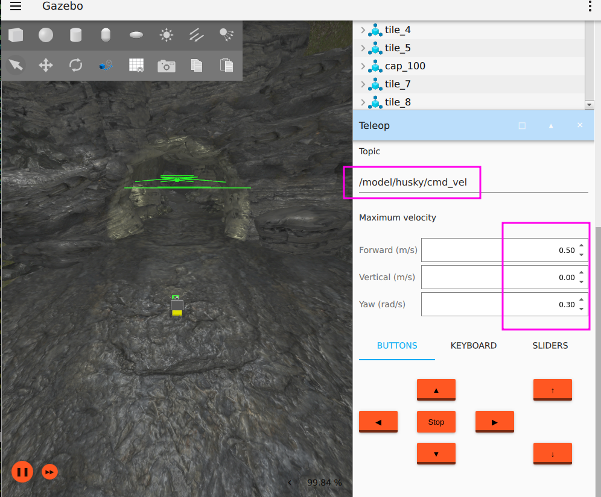

Alternative to the `Teleop` plugin, you can use a joystick for moving the robot. For this, set the argument `use_joystick:=True`. Adjust the config files in the folder `/config` of the `ros2_humble_gazebo_sim` package from Step 3. Provide the full paths to the arguments `joy_config_file` and `teleop_twist_config_file` as shown below:

```
ros2 launch start.launch.py use_joystick:=True joy_config_file:=/your_ros2_workspace/ros2_humble_gazebo_sim/simulation/config/joy_config.yaml teleop_twist_config_file:=/your_ros2_workspace/ros2_humble_gazebo_sim/simulation/config/teleop_twist_config.yaml
```

Available arguments:
```
'robot_name':
    Options: husky
    (default: 'husky')

'world_file_name':
    Options: cave_circuit, urban_circuit_practice_03
    (default: 'cave_circuit')

'use_joystick':
    Use a real joystick.
    (default: 'False')

'joy_config_file':
    Full path to the joy config
    (default: 'joy_config_file')

'teleop_twist_config_file':
    Full path to the teleop twist joy config
    (default: 'teleop_twist_config_file')
```

In a new terminal, source your workspace and start SLAM. Remap the node scanmatcher's topic `/input_cloud` to `/husky/scan/points` in the `lidarslam.launch.py`

```
ros2 launch lidarslam lidarslam.launch.py main_param_dir:=/path/to/your/lidarslam.yaml
```


In a new terminal, source your workspace, ugv_nav4d library, and launch the ugv_nav4d_ros2. Replace the /path/to/your/ugv_nav4d with the location of the ugv_nav4d library. Add this command to your terminal:

```
source ~/your_ros2_workspace/install/setup.bash
source /path/to/your/ugv_nav4d/build/install/env.sh

ros2 launch ugv_nav4d_ros2 ugv_nav4d.launch.py pointcloud_topic:=/map goal_topic:=/goal_pose
```

### 7. Plan

In a new terminal, start Rviz2.
```
cd ~/your_ros2_workspace
source ~/your_ros2_workspace/install/setup.bash
source /path/to/your/ugv_nav4d/build/install/env.sh
rviz2 -d src/ugv_nav4d_ros2/config/ugv_nav4d.rviz 
```

After you start to move the robot, the planner will show the following status:

```
[ugv_nav4d_ros2]: Planner state: Got Map
[ugv_nav4d_ros2]: Initial patch added.
[ugv_nav4d_ros2]: Planner state: Ready
```

Visualize the MLS in Rviz2 using 

```
ros2 service call /ugv_nav4d_ros2/map_publish std_srvs/srv/Trigger
```
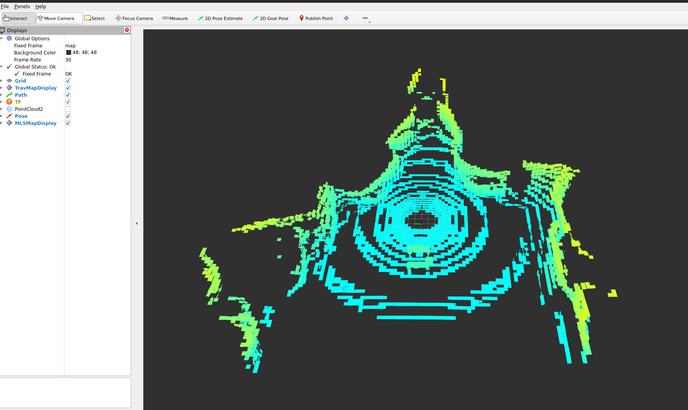

The gaps in the MLS map are due to the gaps in the scanned points. Move the robot around in the environment. After some time, you will see the MLS start to fill out the gaps.

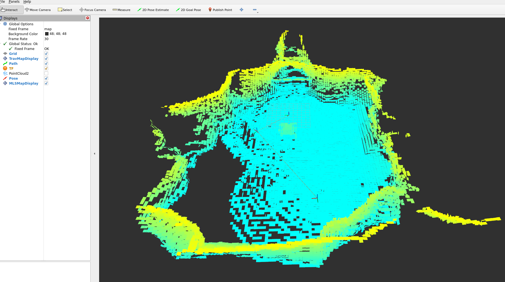

Set a goal using the `2D Goal Pose` option in Rviz2 or by publishing to the topic `/ugv_nav4d_ros2/goal_pose`.

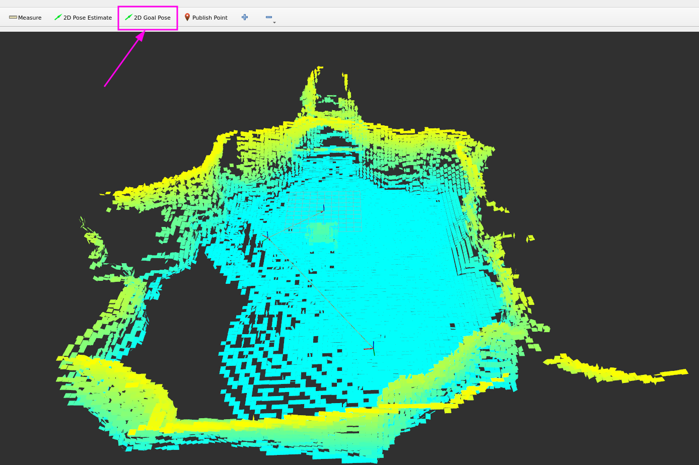

```
ros2 topic pub /goal_pose geometry_msgs/PoseStamped "{header: {stamp: {sec: 0, nanosec: 0}, frame_id: 'map'}, pose: {position: {x: 4.0, y: 4.0, z: 0.0}, orientation: {x: 0.0, y: 0.0, z: 0.0, w: 1.0}}}"
```

#### cave_circuit

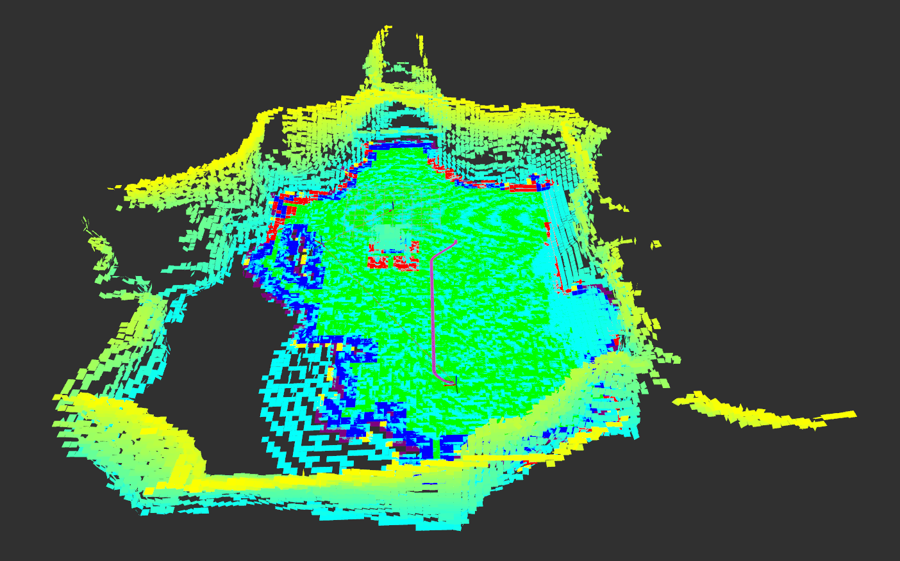

If planning is successful you should see the following status in the terminal:

```
[ugv_nav4d_ros2]: FOUND_SOLUTION
```

#### urban_circuit_practice_03
You could repeat the same steps and in Step 6 set `world_file_name:=urban_circuit_practice_03`.

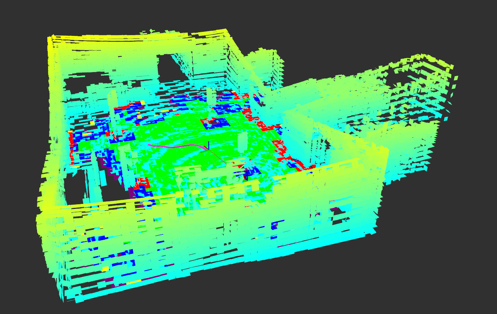

---
## Implementation Details
### Planning
The planner is based on SBPL (http://www.sbpl.net/). I.e. it uses the SBPLs ARA* planner to plan in a custom environment.

#### Environment
SBPL internally uses states (identified by an id only) and associated costs (a unitless integer). The state ids reference states of an environment. That environment has to be defined by the user.
The planner contains the `EnvironmentXYZTheta`. This environment implements all interfaces needed by SBPL to enable ARA* planning (other planning algorithms might require additional interfaces).


A state in this environment consists of the position on the map (xyz) and the orientation of the robot (theta), hence the name. 

The mapping `idToHash` in `EnvironmentXYZTheta` maps the SBPL state ids to instances of `Hash` (our internal representation of a state).
```
struct Hash
{
    XYZNode *node;
    ThetaNode *thetaNode;
};
```

The `Hash` represents a complete planner state. It consists of an `XYZNode` and a `ThetaNode`. The `XYZNode` represents a position on the traversability map while the `ThetaNode` holds the discretized orientation. Together they form a planner state. One `XYZNode` can be part of several states (with different `ThetaNodes`). However, a new `ThetaNode` is created for each state.
The `XYZNode` contains a map to all `ThetaNodes` that it has been associated with during planning. 

All `XYZNodes` are part of the `searchGrid`.
An `XYZNode` is always created from (and corresponds to) a `TravGenNode` and shares the `TravGenNodes` index. I.e. the `XYZNodes` position in the `searchGrid` is the same as the `TravGenNodes` position on the `traversabilityMapGenerator::travMap`. For easy access the `XYZNode` contains a pointer to the corresponding `TravGenNode`.

The `searchGrid` keeps track of the internal state while planning. It contains an `XYZNode` for every grid cell that the planner has already visited.
The `searchGrid` is a `TraversabilityMap` but the traversability information is not used (and never set).
The `TraversabilityMap` was chosen because it enables O(n) (n <= maximum number of layers in the map) lookup of nodes based on their xyz position. The choice was made due to time constraints (the map was there and it worked and there was no time). Semantically the usage of a `TraversabilityMap` to store the `XYZNodes`is wrong and it should be changed (e.g. to a hashmap), but it works and thus was never changed.

#### The `TraversabilityMap`
In addion to the `searchGrid` the environment has access to a `TraversabilityMap3D` (accessed through the `travGen` attribute).

A `TraversabilityMap3D` is generated from an MLS and separates the MLS into traversable, non-traversabel and unknown terrain. Addtionally it contains some meta data (e.g. slope of the patch, supporting plane, etc.).
The map is generated by the `TraversabilityMapGenerator` based on a set of rules.

The `TraversabilityMap3D` has to be fully expanded (i.e. generated from the MLS) before planning. In theory it could be expanded on the fly during planning and the code is prepared to do that, however this was never tested and there is a good chance that on-the-fly expansion will trigger bugs (especially if parallelism is enabled).

The planner uses the `TraversabilityMap3D` to find valid successor states during planning. I.e. states that the robot can traverse to from a given state using the given motion primitives. Metadata stored in the map (e.g. slope) is also used during planning to calculate costs.

#### Color Codes


The visualizer of the `TraversabilityMap3D` uses color coding to indicate the different patch types:
- **Traversable**: The robot can stand (with its center) on this patch in at least one orientation without hitting an obstacle.
- **Not Traversable**: There is no way that the robot can stand (with its center) on this patch.
- **Frontier**: Borders to the end of the map. Should be traversable (I am not 100% sure about this. check the code!)
- **Unknown**: This is a virtual patch that serves as boundary for algorithms. This patch does not exist in reality. Patches also become unknown if there is not enough support in the MLS to be sure that a patch exists in this location.
- **Hole**: This is part of the map specification but is not used by ugv_nav4d. It might be used elsewhere but the planner cannot handle it.
- **Unset**: This is the starting state of a new patch. It should not be visible in a fully explored map. If you see a yellow patch after map expansion is done, you have found a bug in the `TraversabilityMapGenerator` and should investigate.

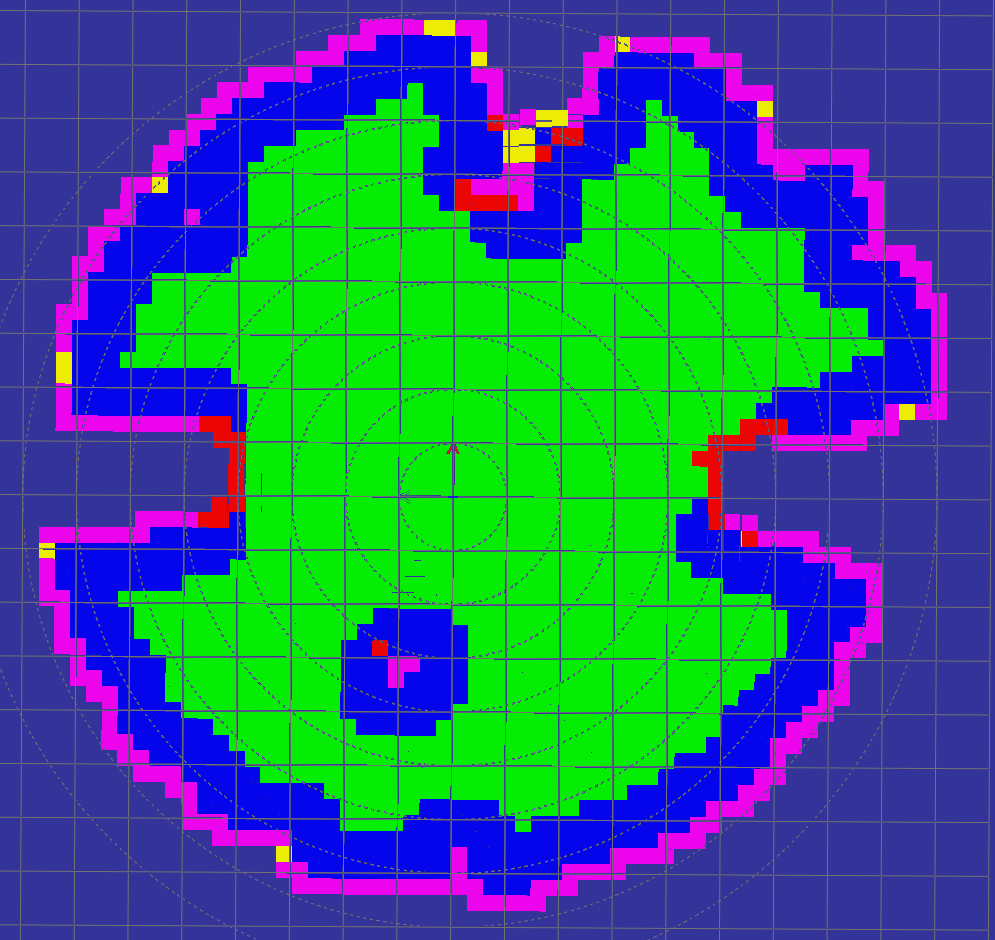

#### Obstacle Checking
To ensure that the robot can traverse a certain area, obstacle checks have to be done.
If we would have infinite resources we could just collide the robot model with the MLS for every possible state and see if it collides or not.
But since we have very limitted resources we cannot do that. Instead there are several obstacle checking phases:

##### 1. Obstacle Checks done during Expansion of the `TraversabilityMap3D`
All obstacle checks in this phase are done using the rotation invariant bounding box of the robot. This is an axis aligned bounding box with side length `min(config.robotSizeX, config.robotSizeY)`. With this check when an a patch is an obstacle we are 100% sure that it is. But if it is not we cannot be sure that it is not. This greatly reduces map size and planning time without costing too much as checks are only done once per patch.
It also means that a full 3D oriented bounding box check is still necessary during planning to factor in different side lengths and the orientation of the robot.

- **Step height check**: A patch is an obstacle if the height between the patch and its neighbors is higher than the maximum step height of the robot. If the robot would stand on this patch, the neighboring patch would be inside the robots body. 
- **Slope check**: A patch is an obstacle if the slope of the patch is above the slope limit.
- **Map limit check**: A patch is an obstacle if the bounding box of the robot (again just using the smaller side length) leaves the map (maximum possible map, not currently known map).

I.e. this step marks patches in the `TraversabilityMap3D` as obstacle if the robot would touch an obstacle when standing (centered) on this patch, or when the slope is too steep.

##### 2. The `ObstacleMap`
The `ObstacleMap` is a `TraversabilityMap3D` and is created by the `ObstacleMapGenerator`.
The generator shares a lot of code with the `TraversabilityMapGenerator`. It differs only in how obstacle checks are done, i.e. what patches are marked as obstacles.

Patches are marked as obstacle if there is a patch above the marked patch and below robot height. I.e. if the robot would stand on this patch, the patch above would be inside the robot.
This is a tiny but important difference. It means that, if the robot is on this patch with even a tiny bit of its body, it would touch an obstacle.

Using the obstacle map, the 3D collision test (that is necessary during planning) is reduced to a 2D oriented bounding box test. This is the only reason for the existence of the obstacle map. It reduces the complexity of the 3D collison check to 2D. Basically the height check is pre-computed for each patch and stored in the obstacle map. 

The `ObstacleMap` is used during planning to check if the robot would hit an obstacle when moving to a certain state. 


#### Heuristic
ARA* is a real-timeish version of A*. Thus it needs a heuristic.

The heuristic h(a,b) between two cells a and b is the time it would take the robot to follow the shortest path from a to b on the TraversabilityMap3D. The shortest path is calculated ***without*** taking any of the following into account:
- the robot dimensions and orientation (The minimum bounding box has already been checked while expanding the map)
- collision checks on the ObstacleMap
- steepness of the terrain (i.e. as long as a patch has a steepness below the limit the costs are the same)
- motion primitives
- motion restrictions of the robot

I.e. it is the path that the robot would be able to follow if it was infinitesimal small and could change direction instantly. 

The heuristic is computed beforehand for all nodes of the map. Changing the code to on-demand heuristic should be possible. It was not done because it was not needed (fast enough for our maps) at the time of writing.

SBPL expects the heuristic to be an integer. To avoid losing precision when converting to int the heuristic value is scaled by `Motion::costScaleFactor` (usually 1000) before conversion. Without the scaling small movements have no cost at all.


#### Motion Primitives
The planner uses motion primitives, a set of pre-defined small motions, to determine how the robot can move from one state to the next.  The primitives are classified into four categories, namely:

**Forward Primitive**
**Backward Primitive**
**Lateral Primitive**
**Point-Turn Primitive**

All four primitive motion types are considered as valid motions. It needs to be mentioned that the point-turn primitives are a special case because they do not use a spline. On the contrary, forward, backward, and lateral motion primitives are splines. 

The basic shapes of the motion primites are generated by the `SbplSplineMotionPrimitives` library.
The library generates primitives using splines based on a few parameters in a perimeter around the robot.

The parameters for primitive generation are grouped in the `SplinePrimitivesConfig` class.

- `gridSize` - The width/height of a grid cell of the planning grid. This should be the same as the resolution of the map. Available end positions will be a multiple of this.
- `numAngles` - The number of discrete start orientations. A full set of primitives will be generated for each orientation.
- `numEndAngles` - The maximum number of end orientation. For each start orientation and each end orientation a full set of primitives will be generated. This is an upper boundry. It might not be reached.
- `destinationCircleRadius` - Radius around the robot (in cells) that primitives will be generated for.
- `cellSkipFactor` - Sparseness of the generated primitives.
- `splineOrder` Order of the generated splines.


Based on the value of the parameter `destinationCircleRadius` a number of discrete destination points are generated on concentric circles. The parameter `CellSkipFactor` decides the interval between each two consecutive concentric circles. Before generating a motion primitive, each destination cell is scaled via multiplication with the `gridSize`. A unique motion primitives is generated for each start angle to each destination cell shown in picture below, from `(0,0)` to that cell for each end angle. The number of start angles and end angles is decided basd on the parameters `numAngles` and `numEndAngles` respectively.


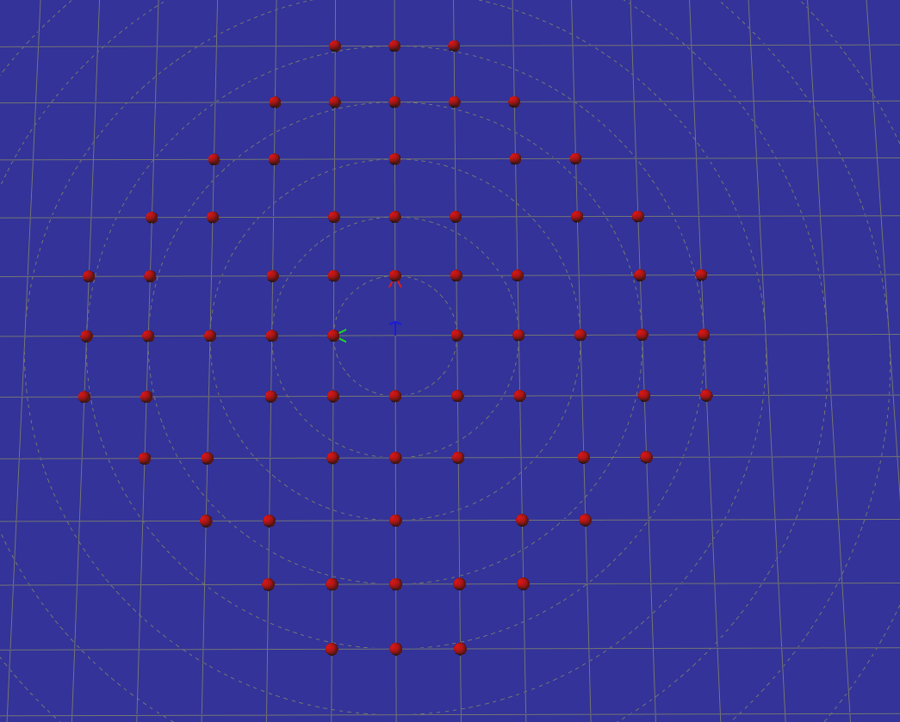

To keep the number of primitives reasonable they are discretized. Their start and end positions are discretized using a 2d grid. The start and end orientations are discretized using angle segments.

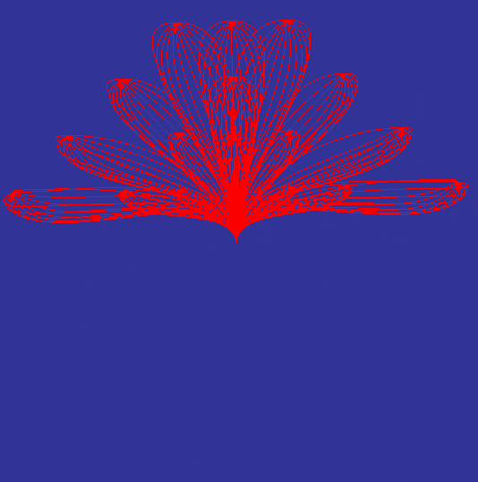

This animation shows all splines generated by the following configuration (each frame shows the primitives for one start orientation). 
```
config.gridSize = 0.1;
config.numAngles = 24;
config.numEndAngles = 12;
config.destinationCircleRadius = 5;
config.cellSkipFactor = 1.0;
config.generatePointTurnMotions = false;
config.generateLateralMotions = false;
config.generateBackwardMotions = false;
config.generateForwardMotions = true;
config.splineOrder = 4;
```
##### Default Parameters
| Parameter | Type |Description | Recommented Value |
|-----------------|:-------------|:-------------|:-------------|
| dumpOnError | bool  | Refer to the section  `Dumping Planner State`  | Release: 0, Debug: 1  |
| dumpOnSuccess    | bool         | Refer to the section `Dumping Planner State`  | Release: 0, Debug: 1 |
| initialPatchRadius     | double        | Radius of initial patch of point cloud points to kick-start the planner  | 3.0 |

##### Mobility Configuration Parameters
| Parameter | Type |Description |Recommented Value |
|-----------------|:-------------|:-------------|:-------------|
| translationSpeed | double  | Linear velocity of the resulting path trajectory  | 1.0 |
| rotationSpeed    | double         | Angular velocity of the resulting path trajectory  | 1.0 |
| minTurningRadius     | double        | The minimum turning radius corresponds to the maximum curvature. This parameter therefore helps to select all motion primitives which have curvature less than the maximum curvature. A higher value means less cap for the maximum curvature resulting in linear primitives. A small value will result in more curvy primitives. Note that a smaller value results in more primitives selected which requires more computation power for the planning. For details see section `Minimum Turning Radius`  | 0.1 |
| multiplierForward | int  | Cost multiplier for the forward motion primitives  | 1 |
| multiplierBackward    | int         | Cost multiplier for the backward motion primitives  | 2 |
| multiplierLateral     | int        | Cost multiplier for the lateral motion primitives  | 2 |
| multiplierForwardTurn | int  | Cost multiplier for the forward turn motion primitives  | 1 |
| multiplierBackwardTurn    | int         | Cost multiplier for the backward turn motion primitives  | 2 |
| multiplierPointTurn     | int        | Cost multiplier for the point turn motion primitives  | 1 |
| multiplierLateralCurve | int  | Cost multiplier for the lateral curve motion primitives  | 2 |
| searchRadius    | double         |   | 1.0 |
| searchProgressSteps     | double        |   | 0.1 |
| remove_goal_offset     | bool        | Remove the goal offset which is there because of the discretization  | true |
| spline_sampling_resolution     | double        | Resolution used to sample the motion primitive spline  | 0.01 |
| maxMotionCurveLength | double  | The maximum curve length of the selected motion primitives. Small value results in small primitives and a large value results in longer primitives. During testing, it was observed that the planner has a hard time in finding a solution if the value of this parameter is set < 0.6  | 1.3 |

##### Planner Configuration Parameters
| Parameter | Type |Description | Recommented Value |
|-----------------|:-------------|:-------------|:-------------|
| initialEpsilon | int  | The planner uses ARA* planner. It finds a sub-optimal solution and then repairs the initial solution by using reducing the epsilon by the parameter `epsilonSteps`. An optimal solution means epsilon is equal to 1, where `solution = epsilon x optimal_solution`   | 36  |
| epsilonSteps    | int         | The steps in the epsilon during planning and repairing of the initial sub-optimal solution  | 6 |
| numThreads     | int        | A limit on the threads allocated for the planner during planning.  | 8|
| usePathStatistics     | bool        | Should a computationally expensive obstacle check be done to check whether the robot bounding box is in collision with obstacles. This mode is useful for highly cluttered and tight spaced environments.  | false|
| searchUntilFirstSolution     | bool        | Search only until the first solution and then stop planning. See SBPL documentation for an explantion of this value.  | false |


##### Primitives Configuration Parameters
| Parameter | Type |Description | Recommented Value |
|-----------------|:-------------|:-------------|:-------------|
| gridSize | double  | The size of the traversability map grid  | Use case specific |
| numAngles    | int         | number of discrete start angles angles. A full set of primitives will be generated for each start angle (has to be even number). For best performance, the value should be a multiple of 4. The multiple of 4 means that correct lateral motion primitives are generated. The reason for this is that the lateral motions are seen as 90 degree rotated motions from any given start angle. For this, the start angle is divided by 4 (because of 4 quadrants) and the result is subracted from the start angle  | 40 |
| numEndAngles     | int        | The number of end angles for each destination cell. The value has to be <= numAngles/2 and odd | 9|
| destinationCircleRadius     | int        | See section `Motion Primitives`  | 6 |
| cellSkipFactor     | int        | See section `Motion Primitives`. It is best to leave this value at >= 1 in integer steps. A value of less than 1 results in duplicate destination cells and do not add any value to the planning  | 1 |
| splineOrder     | int        | The value has to be >= 3  | 3.0 |
| generateForwardMotions     | bool        | Generate forward motion primitives. Forward primitives are for the case where destination cell x-coordinate > 0.1 |  Use case specific |
| generateBackwardMotions     | bool        | Generate backward motion primitives. Backward primitives are for the case where destination cell x-coordinate < -0.1  |  Use case specific |
| generateLateralMotions     | bool        | Generate lateral motion primitives. Lateral primitives are for the case where the destination cell x-coordinate > -0.1 and destination cell x-coordinate < 0.1  |  Use case specific|
| generatePointTurnMotions     | bool        | Generate point-turn motion primitives. A point-turn is generated for each start angle to each end angle  |  Use case specific |

##### Traversability Configuration Parameters
| Parameter | Type |Description | Recommented Value |
|-----------------|:-------------|:-------------|:-------------|
| maxStepHeight | double  | The maximum step height that the robot can traverse. This is used during map expansion. Steps heigher than this become map boundaries   | Use case specific  |
| maxSlope    | double         | Maximum traversable slope above which no travmap entries will be generated | 0.45 |
| inclineLimittingMinSlope     | double        |   | 0.2 |
| inclineLimittingLimit | double  |  | 0.1 |
| costFunctionDist    | double         | Objects within a corridor of width costFunctionDist around a trajectory will influence the cost function. A higher value results in large computation cost requirements for the planning.  | 0.0 |
| minTraversablePercentage     | double        | This value controls, how unknown patches are detected. If only a certain percentage of MSL patches are present on the surface of a traversability patch, it is rated as an unknown patch.    | 0.4 |
| robotHeight | double  |  | Use case specific  |
| robotSizeX    | double         | The length of the robot along x-axis   | Use case specific |
| robotSizeY     | double        | The length of the robot along y-axis| Use case specific |
| distToGround | double  | Distance from body frame to ground. Start and goal position are expected in body frame  | Use case specific  |
| slopeMetricScale    | double         |   | 1.0 |
| slopeMetric     | double        | The slope metric used to adjust the cost of a motion | Use case specific |
| gridResolution | double  | The resolution of the traversability grid map  | Use case specific |
| initialPatchVariance    | double         |   | 0.0001|
| allowForwardDownhill     | bool        |   | true |
| enableInclineLimitting | bool  |  | false  |

##### Motion Primitive Filtering

###### Minimum Turning Radius
The planner filters the primitives by `minTurningRadius` (i.e. all primitives that have a curvature that is larger than allowed by the minimum turning radius are ignored)

The following animation shows the same primitives as above but filtered with a `minTurningRadius` of `0.2`:

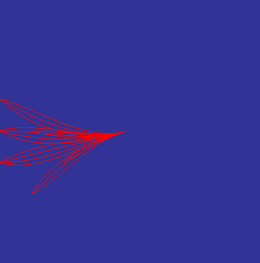

As you can see all sharp turns have been removed from the splines.

After filtering the splines are sampled using the planning grid resolution and the base cost for each motion is calculated. The sampled positions are later used during planning.

If your environment contains tight spots it is recommended to enable `generateBackwardMotions`. Otherwise the planner will have a hard time finding solutions to get to the correct end orientation in tight spots.

###### Maximum Curve Length
You can filter the primitives using the parameter `maxMotionCurveLength`. All primitives which have a curve length less than the `maxMotionCurveLength` will be selected.

The figure below shows the complete set of discritized splines, **without any curve length filter applied**, generated for the start angle of 0 radians. The green color signifies discritized primitives for forward motion, magenta for backward motion, and orange for lateral motion. Please note that the point-turns do not have a spline and therefore are not visible in the image below.

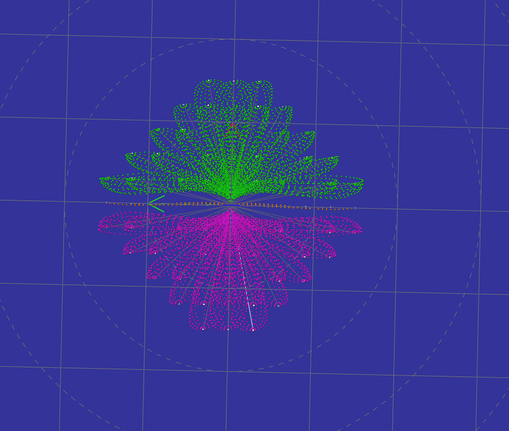

The figure below shows the same set of discritized splines for start angle of 0 radians but with a `maxMotionCurveLength` of 1.2.

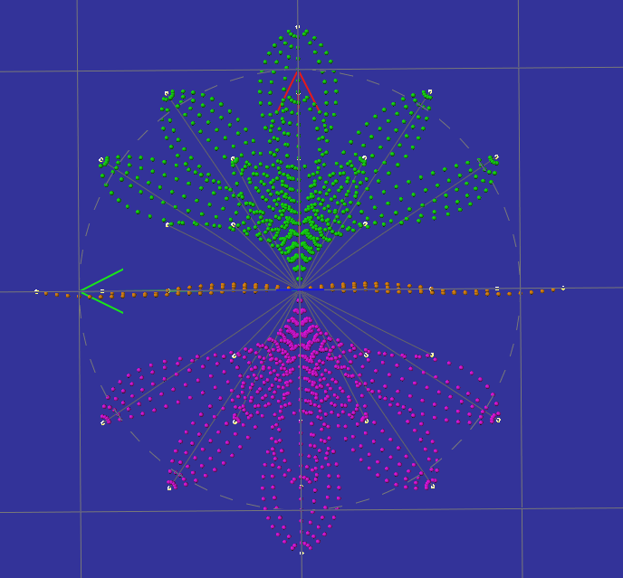

To get an idea about different geometric lengths of the primitives see the picture below. The picture shows only forward and backward motion primitives. Each arrow represents the end of a unqiue primitive. As mentioned earlier, the end points of the primitives are the destination cells scaled by the grid size of the traversability map. 

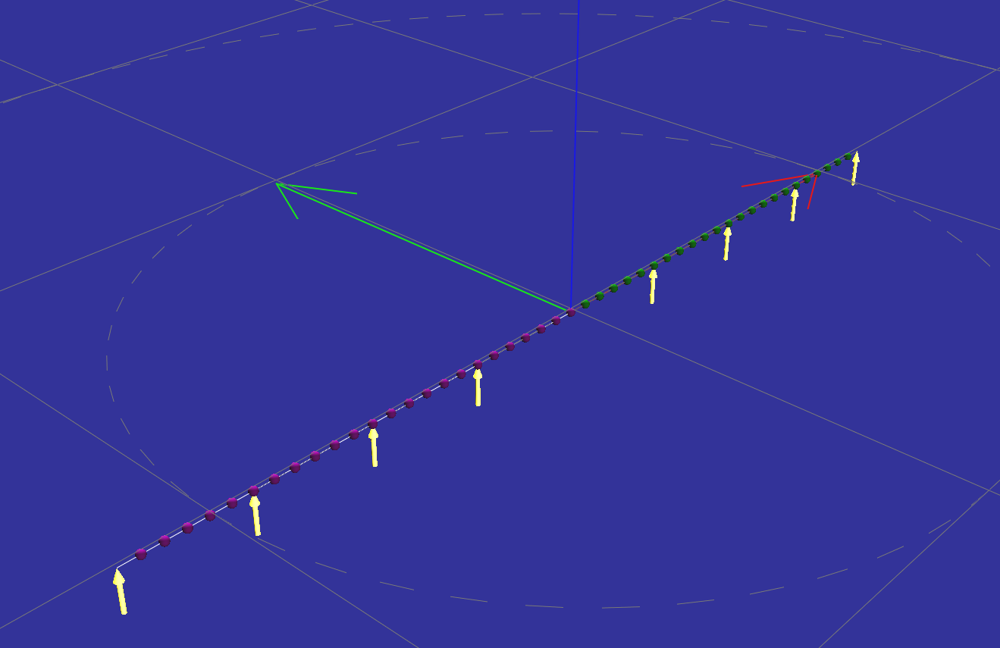

##### Motions
Each slected motion primitive is converted into a motion. A motion is a discritized motion primitive. In the planning phase, each discrete step of the motion is used to perform traversability and obstacle checks. You can find details on the motions in the class preComputedMotions.


##### Motion Base Cost Calculation
Upon motion generation every motion is asigned a base cost.
I.e. the cost that would arise when the robot would follow that motion on a horizontal flat surface.
Factors for steepness and other penalties might be factored later during planning on a case to case basis.

The base cost for each motion is calculated as follows:
```
translationDist = < distance that the robot has to travel while following the spline >
rotationDist    = < amount that the robot has to turn while following the spline >
translationTime = translationalDist / translationVelocity
rotationTime    = rotationDist / angularVelocity
travelTime      = max(rotationTime, translationTime)
costMultiplier  = < the configured multiplier for this particular motion type >
baseCost        = int(ceil(travelTime * 1000 * costMultiplier))
```
The travelTime is scaled by 1000 to retain three digits of precision when converting to integer.

##### Motion Cost Scaling

Since all primitives are 2-dimensional the `baseCost` is only accurat on perfectly flat terrain. To factor in the slope of the terrain the cost is scaled based on one of the following metrics during planning.

###### SlopeMetric::NONE
```
cost = motion.baseCost;
```
###### SlopeMetric::AVG_SLOPE
```
slopeFactor = < avg slope under spline> * config.slopeMetricScale;
cost = motion.baseCost + motion.baseCost * slopeFactor;
```
###### SlopeMetric::MAX_SLOPE
```
slopeFactor = < max slope under spline> * config.slopeMetricScale;
cost = motion.baseCost + motion.baseCost * slopeFactor;
```
###### SlopeMetric::TRIANGLE_SLOPE
This one is a little tricky. 
We take the length of the spline and project it onto the slope between the start and end position. Then we measure the length of the projected line and use that to re-calculate the cost using the base cost formula (see above). This should give a good approximation of the real travel time needed to move up (or down) a slope.
```
heightDiff = < height difference between start and end of motion >
approxMotionLen = sqrt(motion.translationlDist^2 + heightDiff^2)
cost = calculateCost(approxMotionLen)
```

None of those metrices captures the real cost of moving up or down a slope. They have been implemented for experimentation. However those experiments have never been done (we ran out of time and there where no slopes in the final demo). Thus the performance of the metrices is unclear.


#### Dumping Planner State
In case of error the `Planner` dumps its state to a file (this can be enabled using the `dumpOnError` parameter).
The state can be loaded and analyzed using the `ugv_nav4d_replay` binary. This binary loads the state and executes the planning in a controlled environment. This can be used to debug the planner. 


#### User Interfaces
Two user interfaces can be found in `src/gui`. They are intended for testing and debugging.

##### PlannerGui
The `PlannerGui` is the main testing gui. It is designed to experiment with differen planner parameters on a static map.
It can load point clouds from ply or serialized mls maps. 
A left click sets the start location, a right click sets the end location.

In addition the `PlannerGui` can also be used to load and analyze planner dumps.

## Bug Reports

To search for bugs or report them, please use GitHubs [Issue-Tracker](https://github.com/dfki-ric/ugv_nav4d/issues)
