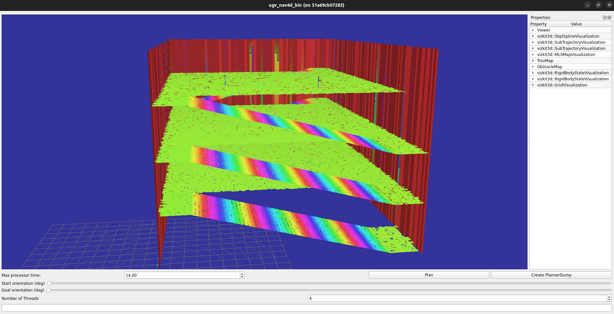
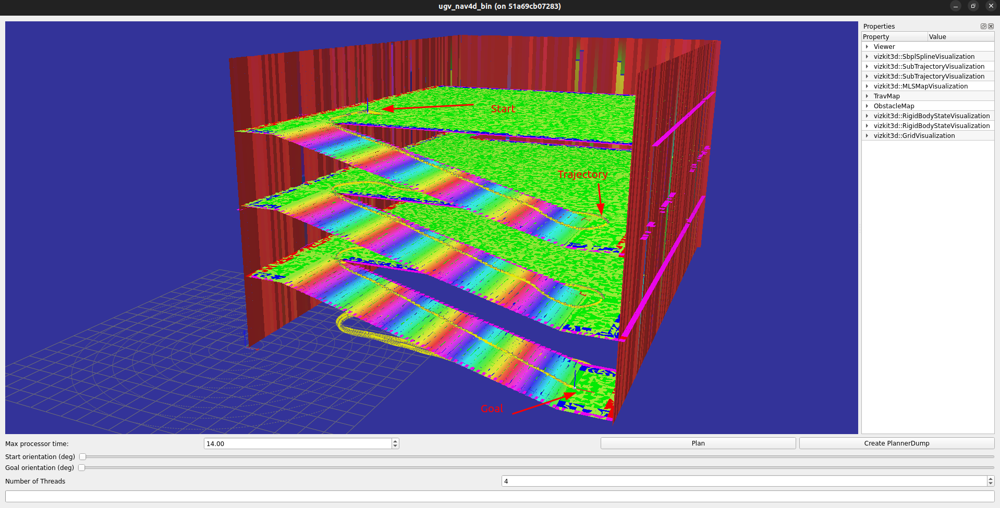
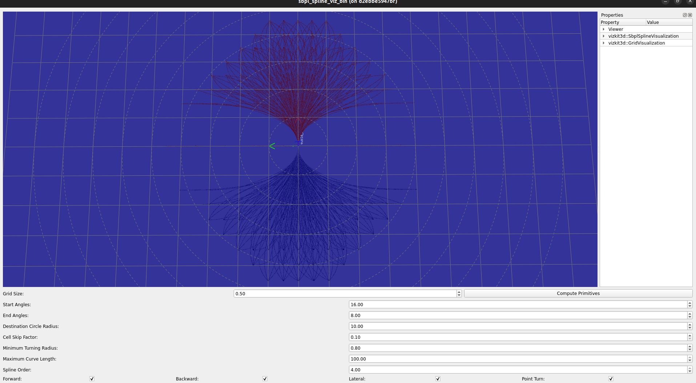

CI build (main):  

JOSS Paper: 
[](https://doi.org/10.21105/joss.06983)

ugv_nav4d: Advanced Multi-Surface Navigation for Unmanned Ground Vehicles Using 4D Path Planning Techniques
=============
A 4D (X,Y,Z, Theta) Planner for Unmanned Ground Vehicles.

<figure>

</figure>

## Statement of need
Accurate ground surface representation is crucial for ground-based robots in complex terrains. The [ROS2 Navigation Stack](https://docs.nav2.org/), which uses voxel maps for 3D navigation, often loses detail and accuracy, especially in multi-storey environments, due to its discrete voxelization and separate costmaps for each floor.

We propose ugv_nav4d, a path planner that enhances environmental representation with [Multi-Layered Surface Maps](https://github.com/envire/slam-maps) (MLS) and a 3D [Traversability Map](https://github.com/dfki-ric/traversability_generator3d.git). Ugv_nav4d avoids the "stepping" effect of voxel maps by using a continuous grid and detailed vertical information, providing smoother and more accurate terrain modeling.

Unlike nav2, ugv_nav4d simplifies planning with a single TraversabilityMap3D, which contains detailed ground surface data, offering a superior alternative to nav2’s 3D costmaps. For users, MLS maps provide a smoother, more realistic view of terrain compared to the blocky voxel maps, enhancing navigation and decision-making in complex environments.

---

## Documentation Index
To make the library easier to navigate, the documentation has been organized into modular guides:

* **[Implementation Details](doc/implementation_details.md):** In-depth technical architecture, state space representations, collision-checking pipelines, heuristics, and primitive spline details.
* **[ROS 2 Humble Simulation Environment Setup](doc/ros2_setup.md):** Instructions for setting up Husky (Gazebo Fortress) and Turtlebot3 (Gazebo Classic) integration with Nav2.
* **[Parameter Tuning Guide](doc/tuning_guide.md):** A comprehensive reference guide for all config variables found in `parameters.yaml`.

---

## Installation

Follow the steps to perform a standalone build of the library.

### System Requirements
```
OS: Ubuntu 20.04, Ubuntu 22.04, Ubuntu 24.04
```
See [install_os_dependencies.bash](source_dependencies/install_os_dependencies.bash) for further OS package requirements.

### Get the library
```bash
git clone https://github.com/dfki-ric/ugv_nav4d.git
```

### Automatic Install of Dependencies & Build
Install dependencies automatically when building `ugv_nav4d`. Defining `-DINSTALL_DEPS=ON` for cmake builds and installs the source dependencies automatically. When `-DCMAKE_INSTALL_PREFIX` is used, the dependencies are also installed there. The install script generates an `env.sh` file in the `CMAKE_INSTALL_PREFIX` folder which exports all necessary environment variables.

```bash
cd ugv_nav4d
mkdir build && cd build
cmake -DINSTALL_DEPS=ON -DCMAKE_INSTALL_PREFIX=./install ..
make install
source install/env.sh
```

### Manual Installation of Dependencies & Build
*Skip this step if you already installed dependencies automatically in the previous step.*

Define a `path_to_install_folder` e.g. `./install` where the dependencies will be installed:
```bash
cd ugv_nav4d
mkdir build && cd source_dependencies
bash ./install_os_dependencies.bash
bash ./build.bash ../build/install
```

After all dependencies have been installed, go back to the main folder to build and install `ugv_nav4d`:
```bash
cd ../build
source install/env.sh
cmake -DCMAKE_INSTALL_PREFIX=./install -DTESTS_ENABLED=OFF -DENABLE_DEBUG_DRAWINGS=OFF -DCMAKE_BUILD_TYPE=RELEASE ..
make install
```

### Compiling inside a ROCK environment [Only for ROCK users]
See `manifest.xml` for an up-to-date list of dependencies. If you are a ROCK user, include the package set containing `dfki-ric/orogen-ugv_nav4d` in your autoproj manifest file.

### API Documentation
The API documentation is available at [https://dfki-ric.github.io/ugv_nav4d/](https://dfki-ric.github.io/ugv_nav4d/)

---

## GUI Usage & Tests

Source the `env.sh` in the install folder.

### Configuration
The planner GUI loads configuration from `gui/config/parameters.yaml`. This file contains default parameters for spline characteristics, vehicle mobility, traversability limits, and search heuristic configurations. See the **[Parameter Tuning Guide](doc/tuning_guide.md)** for detailed adjustment descriptions.

### Running the GUI
Retrieve the test point cloud map and start the GUI:
```bash
cd ..
source build/install/env.sh
wget https://zenodo.org/record/13789320/files/parking_deck.ply
ugv_nav4d_bin-qt5 parking_deck.ply
```


A basic GUI is loaded with the Multi-layer Surface Map of a parking deck environment. Use the mouse left-click to select a start position and mouse right-click to select the goal position. The sliders can be used to change the orientations of start and goal positions. Click the button `Plan` to plan a path.



The button `Create PlannerDump` can be used to save the planner's state. The created file e.g., `ugv4d_dump_xxxx.bin` can be replayed using the executable `ugv_nav4d_replay`:
```bash
ugv_nav4d_replay ugv4d_dump_xxxx.bin
```

An additional GUI is provided for tuning parameters used in generating motion primitives and visualizing the generated splines.


Run the following executable in your terminal:
```bash
sbpl_spline_viz_bin
```

### Unit Tests
Build the library with `-DTESTS_ENABLED=ON` enabled:
```bash
cd build
cmake -DCMAKE_INSTALL_PREFIX=./install -DTESTS_ENABLED=ON -DENABLE_DEBUG_DRAWINGS=OFF -DCMAKE_BUILD_TYPE=RELEASE ..
make install
```
The test executables are located in the folder `build/src/test/`.

---

## Bug Reports
To search for bugs or report them, please use the GitHub [Issue-Tracker](https://github.com/dfki-ric/ugv_nav4d/issues).
