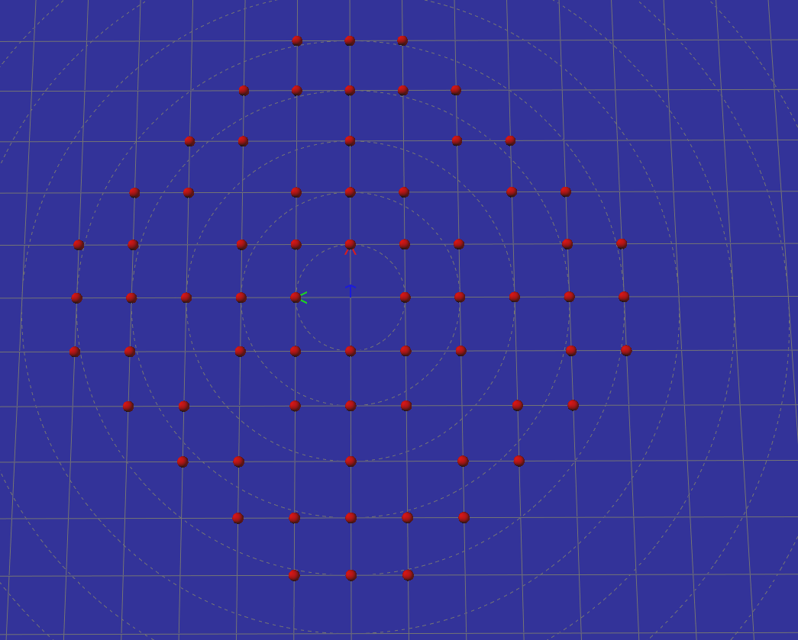
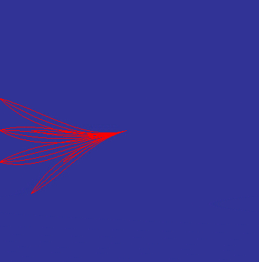

# Implementation Details

This document explains the technical architecture, mathematical concepts, and configuration parameters of the `ugv_nav4d` path planner library.

---

## Planning

The planner is based on the [SBPL (Search-Based Planning Library)](http://www.sbpl.net/) framework. It utilizes the SBPL ARA* (Anytime Repairing A*) planner to plan paths on a custom multidimensional grid environment.

### Environment (4D State Representation)

SBPL internally identifies states purely by unique numeric IDs and associated costs (integer-scaled). The translation between environment geometry and state IDs is implemented in `EnvironmentXYZTheta`.

A state in this environment consists of the robot's position on the map $(X, Y, Z)$ and the discretized orientation of the robot $(\theta)$, hence the name.

* **State Mapping:** The hash map `idToHash` in `EnvironmentXYZTheta` maps SBPL state IDs to instances of `Hash` (our internal representation of a state):
  ```cpp
  struct Hash
  {
      XYZNode *node;
      ThetaNode *thetaNode;
  };
  ```
  The `XYZNode` represents a position on the traversability map while the `ThetaNode` holds the discretized orientation. Together they form a planner state. One `XYZNode` can be part of several states (with different `ThetaNodes`). A new `ThetaNode` is created for each state. The `XYZNode` contains a lookup map to all `ThetaNodes` that it has been associated with during planning.

* **Search Grid:** All `XYZNodes` are registered in the `searchGrid`. An `XYZNode` is created from (and corresponds to) a `TravGenNode` and shares its index. The `searchGrid` keeps track of the internal state while planning, storing nodes for every grid cell the planner has already visited. 

* **The searchGrid Structure:** The `searchGrid` is implemented as a `TraversabilityMap` because it enables $O(n)$ lookup (where $n$ is the maximum number of vertical layers) of nodes based on their $(X, Y, Z)$ coordinate.

---

### The `TraversabilityMap3D`

In addition to the `searchGrid`, the environment accesses a `TraversabilityMap3D` (representing terrain features). The `TraversabilityMap3D` is generated from a Multi-Level Surface (MLS) Map using the [traversability_generator3d](https://github.com/dfki-ric/traversability_generator3d) library. It divides the world into:
- **Traversable** terrain
- **Non-traversable** terrain (obstacles)
- **Unknown** terrain
It also stores metadata such as slope inclinometry and local support planes.

* **Expansion:** The `TraversabilityMap3D` has to be fully expanded (i.e. generated from the MLS) before planning. On-the-fly expansion during planning is experimental and not recommended when using thread-parallel search.
* **Successors:** The planner uses the `TraversabilityMap3D` to evaluate valid successor states (where the UGV can physically drive using its motion primitives) and computes their transition costs using the local terrain slope and surface types.

---

### Obstacle Checking

To keep collision checking computationally lightweight, obstacle checks are executed in hierarchical phases:

#### 1. Pre-computation Phase (during TraversabilityMap3D generation)
Checks in this phase use the rotation-invariant bounding box of the robot (a square bounding box of size `min(robotSizeX, robotSizeY)`):
* **Step height check:** A patch is marked as an obstacle if the height difference between it and any neighbor exceeds `maxStepHeight`.
* **Slope check:** A patch is marked as an obstacle if its inclination slope exceeds `maxSlope`.
* **Map limit check:** Prunes nodes where the robot's bounding box leaves the map boundary.
* **Overhead clearance check:** Patches are marked as obstacles if there is another surface layer above them that is lower than `robotHeight`.

#### 2. Online Phase (during Search/Expansion)
Because phase 1 uses the rotation-invariant bounding box, a detailed 3D oriented bounding box (OBB) check using the actual UGV length (`robotSizeX`), width (`robotSizeY`), and current heading ($\theta$) is executed during primitive evaluation in `GetSuccs()`.

---

### Heuristic

Since ARA* is a heuristic-driven search, it requires a heuristic function. The heuristic $h(a, b)$ between two states $a$ and $b$ is the time it would take the robot to follow the shortest path from $a$ to $b$ on the `TraversabilityMap3D`.

This shortest path is computed **without** taking any of the following constraints into account:
1. Oriented robot dimensions and orientation.
2. Complex collision checks.
3. Terrain steepness (as long as it is below `maxSlope`).
4. Motion primitive kinematics (assumes UGV can change direction instantly).

This path represents the theoretical limit of a point robot. The heuristic is precomputed for all nodes in the map. To retain precision when converting to SBPL's integer costs, the heuristic value is scaled by `Motion::costScaleFactor` (usually `1000`).

---

### Motion Primitives

The planner uses pre-defined small motion sequences (primitives) to evaluate transitions between states. They are divided into:
1. **Forward** (spline-based)
2. **Backward** (spline-based)
3. **Lateral** (spline-based, sideways crabbing)
4. **Point-Turn** (in-place rotation, non-spline)

The shapes of these primitives are generated by the `SbplSplineMotionPrimitives` library and configured by `SplinePrimitivesConfig`:
* `gridSize`: Resolution of the planning grid (should match traversability resolution).
* `numAngles`: Number of discrete start orientations. A primitive set is generated for each angle.
* `numEndAngles`: Maximum number of end orientations for each destination cell.
* `destinationCircleRadius`: Reach radius around the robot (in grid cells) for spline ends.
* `cellSkipFactor`: Sparseness step size of the concentric circles of destinations.
* `splineOrder`: Mathematical order of the NURBS spline curves (typically `4` for continuous curvature).

Based on these parameters, discrete target coordinates on concentric circles are generated. A spline is generated from `(0,0)` to each target cell for every start/end angle combination.



#### 1. Minimum Turning Radius Filtering
Splines with a curvature exceeding the vehicle's physical steering capability are filtered out before search begins:

$$\kappa_{\text{max}} = \frac{1}{\text{minTurningRadius}}$$



#### 2. Maximum Curve Length Filtering
Primitives can also be filtered using `maxMotionCurveLength` to restrict the search step size.

---

### Motion Cost Calculation

Each primitive is assigned a `baseCost` representing the travel time on a perfectly flat surface:

$$\text{translationTime} = \frac{\text{translationDistance}}{\text{translationSpeed}}$$

$$\text{rotationTime} = \frac{\text{rotationDistance}}{\text{rotationSpeed}}$$

$$\text{travelTime} = \max(\text{translationTime}, \text{rotationTime})$$

$$\text{baseCost} = \lceil \text{travelTime} \times 1000 \times \text{costMultiplier} \rceil$$

During planning, the `baseCost` is scaled to account for terrain slopes using the configured `slopeMetric`:

* **`SlopeMetric::NONE`**
  $$\text{cost} = \text{baseCost}$$
* **`SlopeMetric::AVG_SLOPE`**
  $$\text{cost} = \text{baseCost} \times (1 + \text{avgSlope} \times \text{slopeScale})$$
* **`SlopeMetric::MAX_SLOPE`**
  $$\text{cost} = \text{baseCost} \times (1 + \text{maxSlope} \times \text{slopeScale})$$
* **`SlopeMetric::TRIANGLE_SLOPE`**
  Projects the 2D spline path onto the 3D terrain profile:
  $$\text{approxLength}_{3D} = \sqrt{\text{translationDistance}^2 + \Delta Z^2}$$
  And re-evaluates the cost formula using $\text{approxLength}_{3D}$ as the distance.

---

### Dumping Planner State

To facilitate offline debugging, the planner can dump its internal state to a binary file (e.g. `ugv4d_dump_xxxx.bin`) when a planning error occurs. This file can be replayed and inspected in a sandboxed environment using the `ugv_nav4d_replay` executable.
