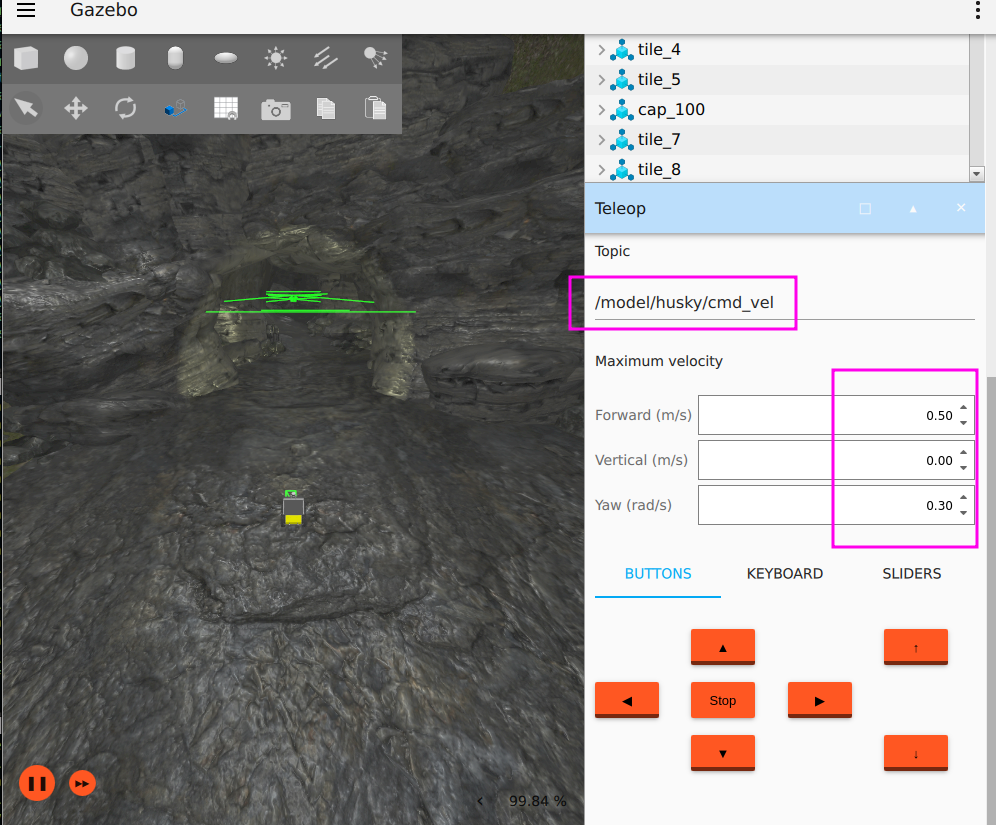
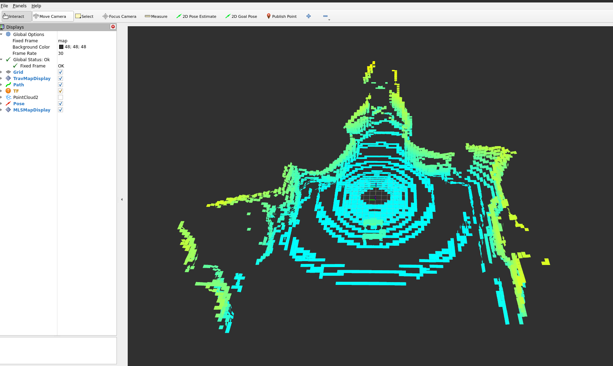
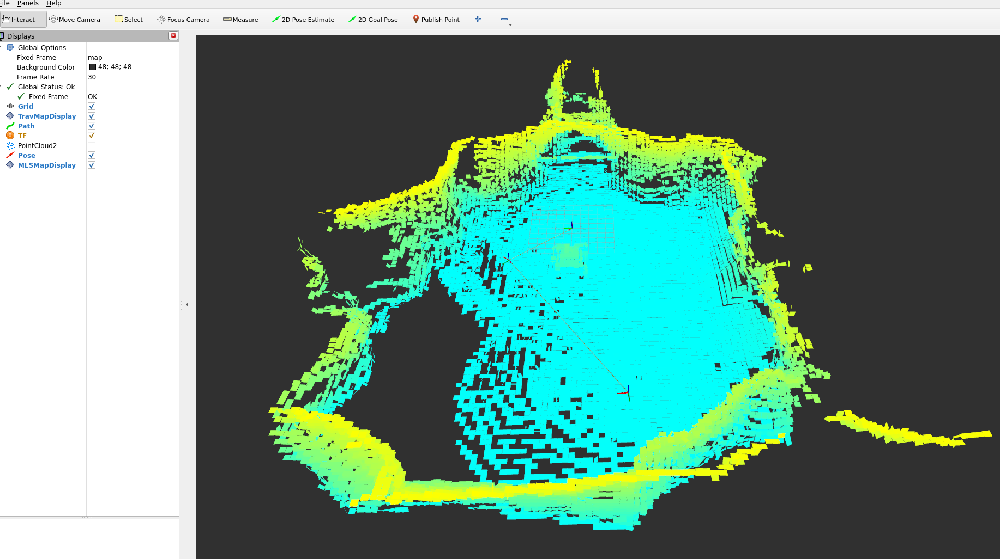
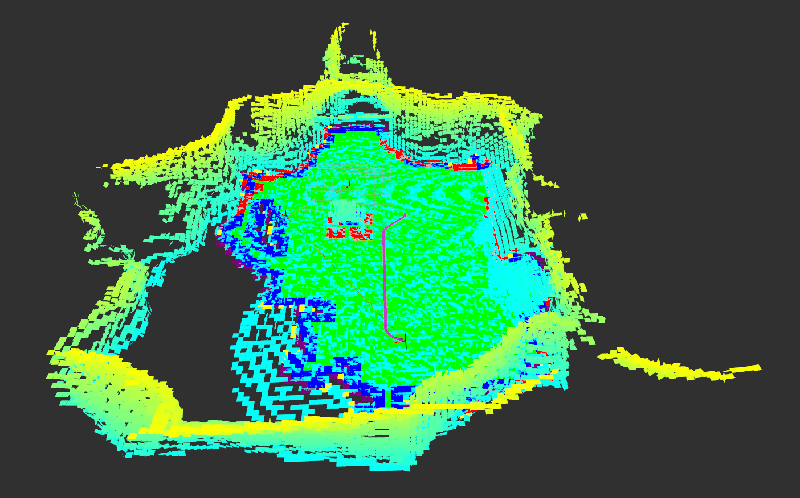
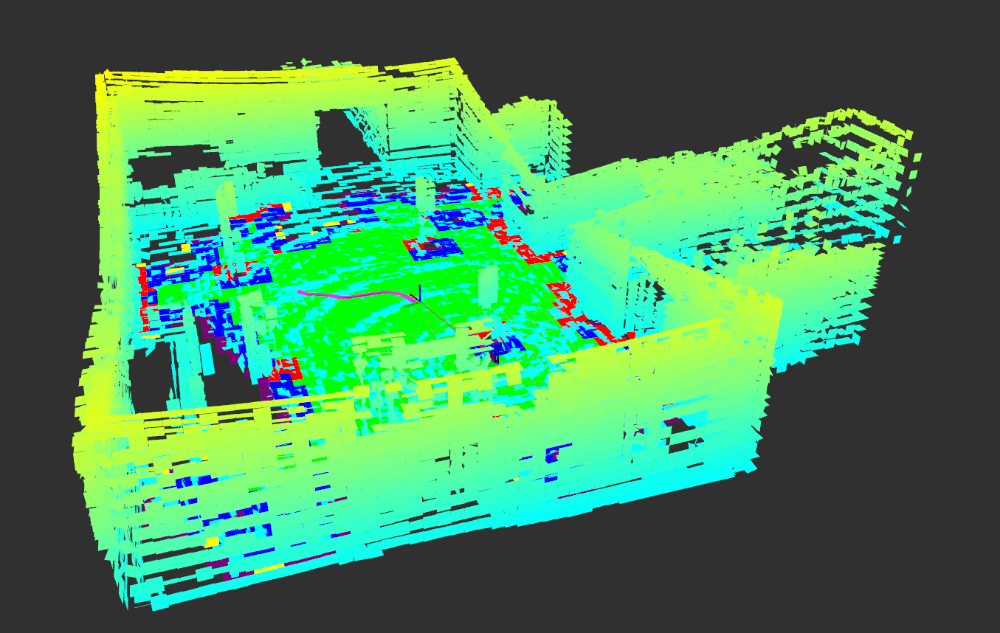

# ROS 2 Humble Test Environment with Turtlebot3 and Husky

This guide provides detailed instructions for setting up a test environment using **Gazebo Fortress** for Husky and **Gazebo Classic** for Turtlebot3 with **ROS 2 Humble**. The setup includes configurations for using the Husky robot and ensures that the necessary resources are in place for smooth operation.

---

## Prerequisites

### 1. Install ROS2 Humble
Ensure you have **ROS2 Humble** installed on your system. Follow the official page at [ROS2 Humble Debian Installation](https://docs.ros.org/en/humble/Installation/Ubuntu-Install-Debs.html).

### 2. Install Gazebo Fortress
If you need to install **Gazebo Fortress**, follow the instructions provided on the official page at [Gazebo Installation](https://gazebosim.org/docs/latest/ros_installation/).

### 3. Install SLAM
If you have a SLAM package which provides a pointcloud map on a topic then you can skip this step. If not then you can use [lidarslam_ros2](https://github.com/rsasaki0109/lidarslam_ros2). Please follow the build and install instructions from the original repository. Set the parameter `robot_frame_id: "husky/base_link"` for the `scanmatcher` node in [lidarslam.yaml](https://github.com/rsasaki0109/lidarslam_ros2/blob/a63b8fa2485e05251505b2bb209598285106bff2/lidarslam/param/lidarslam.yaml#L4).

Install libg2o:
```bash
sudo apt-get install -y ros-humble-libg2o
```

### 4. Get ugv_nav4d_ros2 and a test environment for robot husky in gazebo
```bash
mkdir -p ~/your_ros2_workspace/src
cd ~/your_ros2_workspace/src
git clone https://github.com/dfki-ric/ugv_nav4d_ros2.git
```

You can clone the repo `ros2_humble_gazebo_sim` anywhere in your system. Here we clone it in the `your_ros2_workspace` folder:
```bash
cd ~/your_ros2_workspace
git clone https://github.com/dfki-ric/ros2_humble_gazebo_sim.git
cd ros2_humble_gazebo_sim
bash install_dependencies.bash
```

### 5. Building the ROS 2 Workspace
Before launching the simulation, source your `env.sh` from `ugv_nav4d` and build your ROS 2 workspace:
```bash
cd ~/your_ros2_workspace
source path/to/ugv_nav4d/build/install/env.sh
colcon build --cmake-args -DCMAKE_BUILD_TYPE=Release
```

---

## Turtlebot3 and Nav2 Integration

Install [Nav2](https://docs.nav2.org/development_guides/build_docs/index.html) from the instructions on the homepage.

Follow the steps in this section to play around with a Turtlebot3 and Nav2. `ugv_nav4d` expects a pointcloud map. The map can be provided by SLAM or static pointclouds as `PLY`. An example flat plane `PLY` file is used in these steps.

1. **Install turtlebot3-gazebo package and launch simulation:**
   ```bash
   sudo apt-get install ros-humble-turtlebot3-gazebo
   export GAZEBO_MODEL_PATH=$GAZEBO_MODEL_PATH:/opt/ros/humble/share/turtlebot3_gazebo/models
   export TURTLEBOT3_MODEL=waffle
   ros2 launch turtlebot3_gazebo turtlebot3_world.launch.py headless:=false x_pose:=2.0 y_pose:=2.0
   ```

2. **Clone config repository:**
   ```bash
   cd ~/your_ros2_workspace
   git clone git@github.com:haider8645/turtlebot3_nav2_ugv_nav4d_config.git
   ```

3. **Start the nav2 controller_server:**
   *(Note: Please provide the fullpath for `your_ros2_workspace` in the launch file arguments)*
   ```bash
   cd turtlebot3_nav2_ugv_nav4d_config
   ros2 launch turtle_nav2.launch.py nav2_param_path:=/path/to/your_ros2_workspace/turtlebot3_nav2_ugv_nav4d_config/turtle_nav2.yaml rviz_config_path:=/path/to/your_ros2_workspace/turtlebot3_nav2_ugv_nav4d_config/turtle.rviz
   ```

4. **In a new terminal, configure and activate the nav2 controller_server:**
   ```bash
   ros2 lifecycle set /controller_server configure
   ros2 lifecycle set /controller_server activate
   ```

5. **In a new terminal, start `ugv_nav4d`:**
   *(Note: Please provide the fullpath for `your_ros2_workspace` in the launch file arguments and accordingly edit the parameter `mls_file_path` in `turtle_ugv_nav4d.yaml`)*
   ```bash
   ros2 launch ugv_nav4d_ros2 ugv_nav4d.launch.py goal_topic:=/goal_pose main_param_file:=/path/to/your_ros2_workspace/turtlebot3_nav2_ugv_nav4d_config/turtle_ugv_nav4d.yaml
   ```

6. **In new terminals, start scripts to send FollowPath action calls to nav2 and for Path visualization:**
   ```bash
   cd ~/your_ros2_workspace/src/ugv_nav4d_ros2/scripts
   python3 follow_path_client.py
   ```
   and
   ```bash
   cd ~/your_ros2_workspace/src/ugv_nav4d_ros2/scripts
   python3 visualize_path.py
   ```

7. **Visualize the MLS Map:**
   ```bash
   ros2 service call /ugv_nav4d_ros2/map_publish std_srvs/srv/Trigger
   ```

You can now send goals to the planner using `2D Goal Pose` in Rviz2 and visualize the results.

---

## Husky Integration

1. **Export Environment Variable for Model Lookup:**
   Replace `/path/to/` with the actual **complete** path where you cloned `ros2_humble_gazebo_sim`:
   ```bash
   export IGN_GAZEBO_RESOURCE_PATH=/path/to/your_ros2_workspace/ros2_humble_gazebo_sim/resource:$IGN_GAZEBO_RESOURCE_PATH
   ```

2. **Launch the Gazebo simulation:**
   ```bash
   source ~/your_ros2_workspace/install/setup.bash
   cd ~/your_ros2_workspace/ros2_humble_gazebo_sim/simulation
   ros2 launch start.launch.py
   ```
   You can use the `Teleop` plugin of Gazebo for sending velocity commands to the robot. Click on the three dots in top-right corner of Gazebo window, search for `Teleop`, and adjust values.
   
   

3. **Alternative Joystick Setup:**
   To use a joystick for moving the robot, set the argument `use_joystick:=True`. Adjust the config files in `/config` of the `ros2_humble_gazebo_sim` package. Provide the full paths as arguments:
   ```bash
   ros2 launch start.launch.py use_joystick:=True joy_config_file:=/your_ros2_workspace/ros2_humble_gazebo_sim/simulation/config/joy_config.yaml teleop_twist_config_file:=/your_ros2_workspace/ros2_humble_gazebo_sim/simulation/config/teleop_twist_config.yaml
   ```

   **Available arguments:**
   * `'robot_name'`: Options: `husky` (default: `'husky'`)
   * `'world_file_name'`: Options: `cave_circuit`, `urban_circuit_practice_03` (default: `'cave_circuit'`)
   * `'use_joystick'`: Use a real joystick (default: `'False'`)
   * `'joy_config_file'`: Full path to the joy config (default: `'joy_config_file'`)
   * `'teleop_twist_config_file'`: Full path to the teleop twist joy config (default: `'teleop_twist_config_file'`)

4. **In a new terminal, start SLAM:**
   Remap the node scanmatcher's topic `/input_cloud` to `/husky/scan/points` in the `lidarslam.launch.py`:
   ```bash
   ros2 launch lidarslam lidarslam.launch.py main_param_dir:=/path/to/your/lidarslam.yaml
   ```

5. **In a new terminal, launch the `ugv_nav4d_ros2` node:**
   Replace the `/path/to/your/ugv_nav4d` with the actual build location:
   ```bash
   source ~/your_ros2_workspace/install/setup.bash
   source /path/to/your/ugv_nav4d/build/install/env.sh
   ros2 launch ugv_nav4d_ros2 ugv_nav4d.launch.py pointcloud_topic:=/map goal_topic:=/goal_pose
   ```

6. **In a new terminal, start path visualization script:**
   ```bash
   cd ~/your_ros2_workspace/src/ugv_nav4d_ros2/scripts
   python3 visualize_path.py
   ```

7. **In a new terminal, start Rviz2:**
   ```bash
   cd ~/your_ros2_workspace
   source ~/your_ros2_workspace/install/setup.bash
   source /path/to/your/ugv_nav4d/build/install/env.sh
   rviz2 -d src/ugv_nav4d_ros2/config/ugv_nav4d.rviz 
   ```

   After moving the robot, the planner will show status in the terminal:
   ```
   [ugv_nav4d_ros2]: Planner state: Got Map
   [ugv_nav4d_ros2]: Initial patch added.
   [ugv_nav4d_ros2]: Planner state: Ready
   ```

8. **Visualize the MLS in Rviz2:**
   ```bash
   ros2 service call /ugv_nav4d_ros2/map_publish std_srvs/srv/Trigger
   ```
   
   

   Move the robot around to fill out gaps in the scanner data.
   
   

9. **Set a Goal:**
   Set a goal using the `2D Goal Pose` option in Rviz2 or by publishing to the topic `/ugv_nav4d_ros2/goal_pose`:
   ```bash
   ros2 topic pub /goal_pose geometry_msgs/PoseStamped "{header: {stamp: {sec: 0, nanosec: 0}, frame_id: 'map'}, pose: {position: {x: 4.0, y: 4.0, z: 0.0}, orientation: {x: 0.0, y: 0.0, z: 0.0, w: 1.0}}}"
   ```

   **cave_circuit:**
   
   
   
   If planning is successful, you will see `[ugv_nav4d_ros2]: FOUND_SOLUTION` in the terminal.

   **urban_circuit_practice_03:**
   Set `world_file_name:=urban_circuit_practice_03` in Gazebo launch.
   
   
