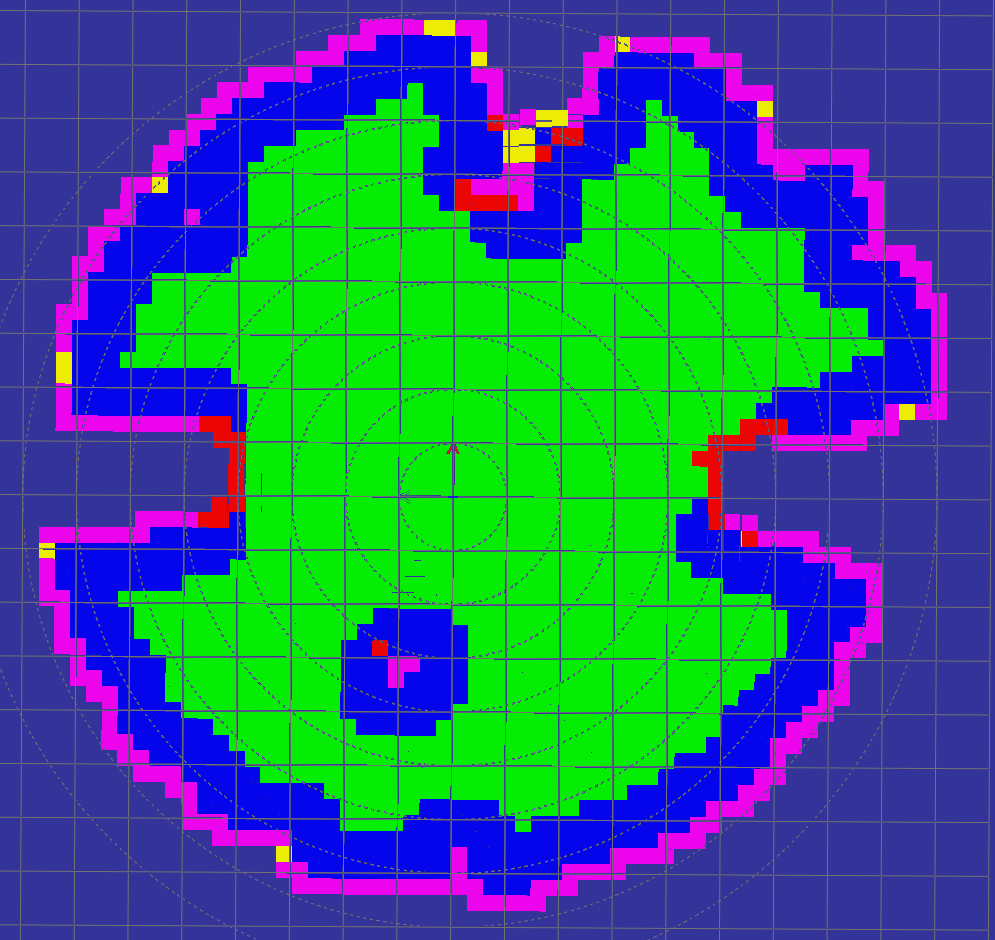
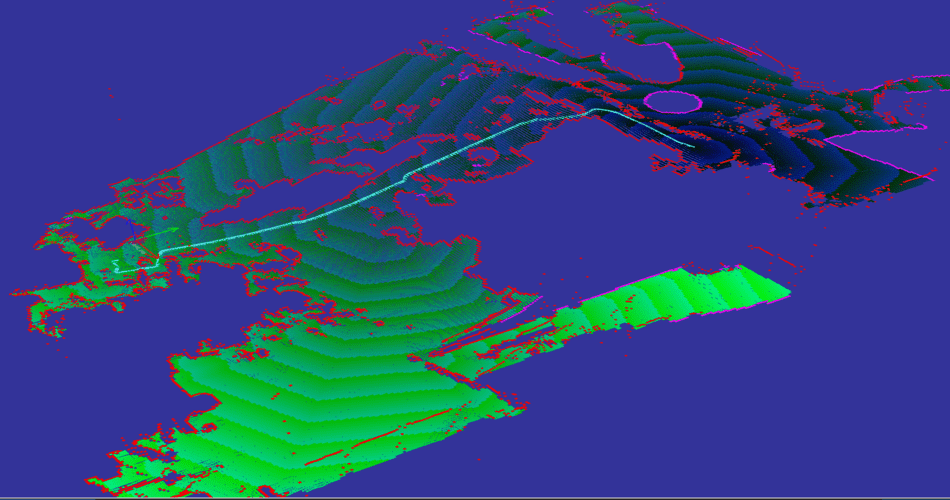
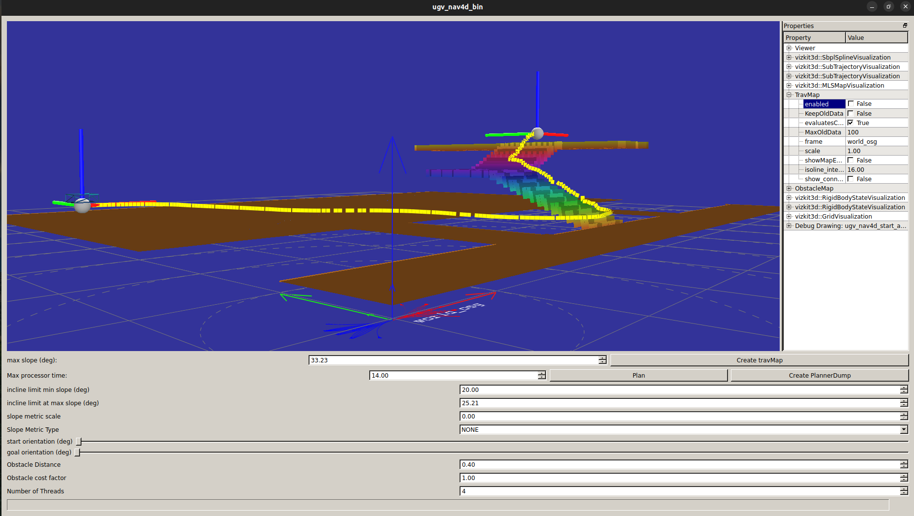
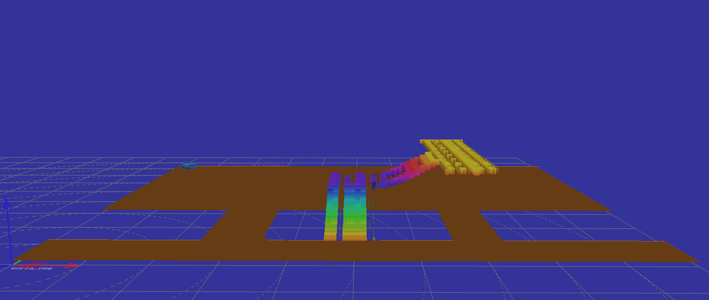
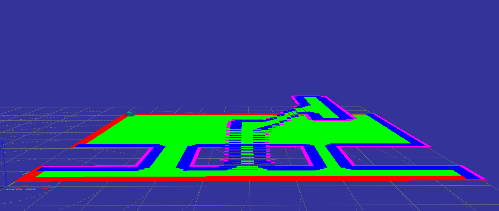
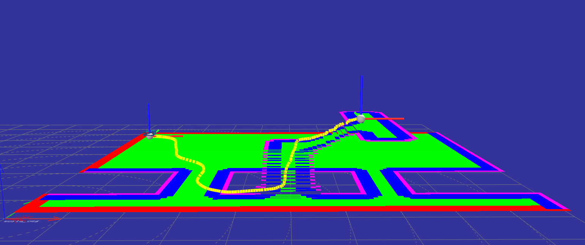

# Summary
Navigation of autonomous mobile robots is a complex problem which comprises of multiple software components, each performing a specific task, which when combined form the navigation software architecture. Ugv_nav4d can be used to navigate complex indoor and outdoor environments. It provides a traversable, motion constraint compliant, and collision free trajectory. It is highly customizable and can be used for any type of terrestrial robot.

To find a traversable trajectory, ugv_nav4d internally maintains a 3D Traversability Map (TraversabilityMap3d) of the environment. The TraversabilityMap3d [@slammaps] is generated based on a multi-layered surface map (MLS [@mlsmaps], [@slammaps]), which enables ugv_nav4d to plan trajectories in multi-surface environments. The trajectory is composed by careful selection and piecing together of motion primitives from a pool of primitives. The primitives are generated based on the specific mechnical features of the robot. As a result, the planned trajectory always fits well with the motion capabilites of the robot. 

In short, ugv_nav4d

- can plan continuous, smooth, and feasible paths in complex indoor and outdoor environments.
- can plan in multi-surface environments, e.g. natural cave system, multi-storey buildings.
- provides a complete trajectory for the planned path which is ready for execution.
- provides a graphical user interface (GUI) for introspection and debugging.

{width="300pt"}

# Statement of need

The ROS navigation stack [@ros2] is undoubtedly the most used open-source robotics framework. This claim can be backed by its widespread usage in research and industry. Navigation2 (nav2) [@macenski2020nav2] is the newest navigation system which is based on the legacy of ROS Navigation. In this paper, we propose a new, fully open-source robot navigation library called ugv_nav4d. Ugv_nav4d presents significant improvements over nav2, particularly in environmental representation and navigation in complex, uneven terrains and multistorey environments. By utilizing Multi-Layered Surface Maps [@mlsmaps] and a 3D Traversability Map [@slammaps], ugv_nav4d offers a more detailed and accurate navigation solution for ground vehicles. These capabilities are essential for operations in challenging terrains and address critical needs within the robotics community. The ongoing development of a ROS2 wrapper for ugv_nav4d aims to facilitate its adoption and integration within the ROS2 ecosystem, providing substantial benefits to the community and enhancing the capabilities of ground vehicle navigation.

### Environment Representation and Mapping Techniques
Nav2 primarily supports 2D occupancy grid maps, where the environment is discretized into a grid of cells marked as occupied or free. This method is suitable for flat, two-dimensional environments but is inadequate for complex and uneven terrains. For 3D mapping, nav2 utilizes voxel maps, which discretize the environment along the x, y, and z axes. While voxel maps are effective for aerial and underwater navigation due to their capacity to represent non-ground obstacles, they introduce steps on sloped surfaces, which can hinder smooth ground vehicle navigation.

In contrast, ugv_nav4d employs Multi-Layered Surface Maps (MLS), representing the environment with a grid in the x and y coordinates while avoiding discretization in the z axis. Each cell contains a list of blocks defined by start and stop heights, with the top of these blocks capable of having a slope value. This method ensures a smooth surface representation, making it highly suitable for navigating uneven ground. The MLS approach eliminates the stepping effect seen in voxel maps, providing a continuous and detailed representation of ground surfaces, including slopes and varying heights.

### Multistorey Navigation Capabilities
In multistorey environments, nav2 would require separate costmaps for each floor, which complicates the navigation process. In contrast, the planner in ugv_nav4d maintains a single 3D Traversability Map, enabling efficient long-distance planning in environments with distinct elevation levels, such as multistorey buildings or terrains with significant height variations. This approach simplifies navigation without the need for multiple costmaps.

### Traversability Analysis
Ugv_nav4d includes detailed ground surface information, such as slope and plane models, in each cell of the traversability map. This can be seen as an advanced alternative to the combination of 3D costmaps and gradient maps in nav2, providing higher accuracy and efficiency.

### Suitability for Different Applications
The voxel maps used by nav2 are more suitable for applications where non-ground obstacles are significant, such as in aerial or underwater navigation. Conversely, the MLS approach in ugv_nav4d, with its smooth surface representation and detailed ground information, is superior for ground vehicle navigation in uneven terrain. This additional accuracy is crucial for effectively handling complex surfaces.

### Visualization Differences
From a user perspective, the visualization of MLS and voxel maps differs significantly. Voxel maps create a blocky representation of the environment, where objects and surfaces are represented by stacked cubes. This can lead to a staircase effect on sloped surfaces, which may not accurately reflect the true nature of the terrain. This visualization is more suitable for scenarios where the focus is on the presence and absence of obstacles, such as in aerial or underwater navigation. On the other hand, MLS maps provide a smoother and more continuous representation of the environment. The lack of discretization in the z-axis allows for a more accurate depiction of slopes and uneven ground surfaces. This results in a more intuitive and realistic visualization for ground vehicle navigation, where the detailed surface information, such as slope and plane models, is critical for planning and decision-making. The smoother surface representation of MLS maps enhances the user’s ability to understand and interpret the terrain, leading to better navigation outcomes.

### Dynamic Environments
The Spatio-Temporal Voxel Layer (STVL) in nav2 is based on 3D voxel grid and supports navigation in dynamic environments. However, as explained earlier, ugv_nav4d maintains a Traversability Map based on the user provided MLS. It is usual practice that only the static environment is mapped in the MLS. As a consequence, the dynamic obstacles will not be taken into consideration during the planning phase of ugv_nav4d. Therefore, ugv_nav4d is suitable for static environments. We are working on various approaches to make it capable of working in dynamic environments.
 
# Software Components 
The core software components are 

- EnvironmentXYZTheta
- PathPlanner
- PreComputedMotions

### EnvironmentXYZTheta 
The core of ugv_nav4d is based on SBPL [@sbpl]. The environment in SBPL internally uses states and associated transition costs. ugv_nav4d uses the EnvironmentXYZTheta because this environment implements all interfaces needed by SBPL to enable ARA* based planning. A state in this environment consists of the position on the map (x,y,z) and the orientation of the robot (yaw). The EnvironmentXYZTheta uses TraversabilityGenerator3d [@travgen3d] to generate a TraversabilityMap3d from a MLSMap. The TraversabilityGenerator3d classifies the MLSMap patches into traversable, non-traversable, and unknown terrain. The nodes in TraversabilityMap3d contains meta data of the ground surface (e.g., slope of the patch, supporting plane, etc.). 

{width="200pt" height="300pt"}

`Traversable [Green]`: The robot can stand (with its center) on this patch in at least one orientation without hitting an obstacle. 

`Obstacle [Red]`: There robot will be in collision if it stands (with its center) on this patch. 

`Frontier [Blue]`: Borders to the end of the map.  

`Unknown [Purple]`: This is a virtual patch that serves as boundary for algorithms. This patch does not exist in the MLSMap. Patches also become unknown if there is not enough information in the MLSMap to be sure that a patch exists in this location.

![The Moon Crater in the Space Hall at the RIC, DFKI [@roboticsElab]\label{fig:crater}.](figures/space_hall_crater.png){width="200pt" height="300pt"}

The EnvironmentXYZTheta is given the MLSMap of the Space Hall Crater shown in Figure 2 and the resulting TraversabilityMap3d generated by the TraversabilityGenerator3d is shown in Figure 3.

{width="200pt" height="300pt"}

### PathPlanner
The SBPL provided ARA* planner uses a heuristic during the exploration for successor states. The heuristic is the time it would take the robot to follow the shortest path in between two states on the TraversabilityMap3d. Robot and terrain specific information used in the planning phase is: 

- the robot dimensions and orientations are parameters 
- collision checks with obstacles
- steepness of the terrain 
- motion primitives 

The planner generates a complete trajectory for the planned path and the trajectory can be executed by a trajectory follower [@trajectoryfollower].

 in the final demostration of the project [KIMMI-SF](https://robotik.dfki-bremen.de/de/forschung/projekte/kimmi-sf).](figures/motion_planning_hunter.png){width="200pt" height="300pt"}

### PreComputedMotions  
Motion primitives are a set of pre-defined motions which are stored as spline trajectories. Each primitive is a feasible movement of the robot from a given starting pose (x,y,z,yaw). The planner uses primitives to find candidate successor states from the start state. It samples the spline and confirms if the path followed along the spline is traversable and collision free. 

Upon motion generation, every motion is asigned a base cost.
The basic cost is when the robot would follow that motion on a horizontal flat surface. Factors for steepness and other penalties might be factored later during planning on a case to case basis.

Primitives are classified into four categories: 

- Forward Motion Primitive 
- Backward Motion Primitive 
- Lateral Motion Primitive 
- Point-Turn Motion Primitive

{width="200pt" height="300pt"}

The user can adapt the planner for diverse types of ground mobile robots. A typical robot with an Ackermann drive will use forward and backward motion primitives. A differential drive robot can realize point-turn motions in addition to forward and backward motions. An omni-directional robot can realize all four motion types. 

All four primitive motion types are considered as valid motions. It needs to be mentioned that the point-turn primitives are a special case because they do not use a spline. On the contrary, forward, backward, and lateral motion primitives are splines. The basic shapes of the motion primitives are generated by the SbplSplineMotionPrimitives library [@sbplsplineprimitives].  

# Debugging and Unit Tests

### PlannerGui
A GUI is provided for introspection into ugv_nav4d for debugging and testing. Please see the planner parameter details in the ugv_nav4d repository. The PlannerGui is the main testing gui. It is designed to experiment with differen planner parameters on a static map. It can load point clouds from ply or serialized mls maps. A left click sets the start location, a right click sets the end location.

{width="200pt" height="300pt"}

The MLSMap for the GUI can be a .PLY file or a PlannerDump. We provide PLY files for basic multi-surface test environments in the test_data folder of the ugv_nav4d repository. 

{width="200pt" height="300pt"}

{width="200pt" height="300pt"}

{width="200pt" height="300pt"}

In case of error the Planner dumps its state to a file (this can be enabled using the dumpOnError parameter). The state can be loaded and analyzed using the ugv_nav4d_replay binary. This binary loads the state and executes the planning in a controlled environment. This can be used to debug the planner.

### Unit Tests
The unit tests for the planner are developed using GTest [@googletest]. The following tests are implemented:

- Different resolutions for motion primitives and TraversabilityMap3d 
- Invalid goal pose (x,y,z,yaw)
- Invalid start pose of robot (x,y,z,yaw)
- Planning success

# Field Tests
ugv_nav4d has been used extensively in research projects for almost a decade. The planner has performed well in highly unstructured environments e.g. natural cave systems, outdoor rough terrains and in structured environments.

### Projects
Here we have listed some projects in which ugv_nav4d was used for autonomous navigation.

- [Entern](https://robotik.dfki-bremen.de/de/forschung/projekte/entern)
- [ANT](https://robotik.dfki-bremen.de/de/forschung/projekte/ant)
- [VIPE](https://robotik.dfki-bremen.de/de/forschung/projekte/vipe)
- [KIMMI-SF](https://robotik.dfki-bremen.de/de/forschung/projekte/kimmi-sf)
- [HiSE](https://robotik.dfki-bremen.de/de/forschung/projekte/hise)
- [PerSim](https://robotik.dfki-bremen.de/de/forschung/projekte/persim)
- [CoRobX](https://robotik.dfki-bremen.de/de/forschung/projekte/corob-x)

### Robots
ugv_nav4d is a very versatile planner and can be used for any type of a terrestrial robot. Below we have listed some of the many robots which use ugv_nav4d for autonomous navigation.

- [Artemis](https://robotik.dfki-bremen.de/de/forschung/robotersysteme/artemis)
- [Coyote-III](https://robotik.dfki-bremen.de/de/forschung/robotersysteme/coyote-iii)
- [Crex](https://robotik.dfki-bremen.de/de/forschung/robotersysteme/crex)
- [Charlie](https://robotik.dfki-bremen.de/de/forschung/robotersysteme/charlie)
- [Hunter-SE](https://robotik.dfki-bremen.de/de/forschung/robotersysteme/hunterse)
- [SherpaTT](https://robotik.dfki-bremen.de/de/forschung/robotersysteme/sherpatt)
- [Asguard-IV](https://robotik.dfki-bremen.de/de/forschung/robotersysteme/asguard-iv)

# Acknowledgements 
The ugv_nav4d library was initiated and is currently developed at the Robotics Innovation Center of the German Research Center for Artificial Intelligence (DFKI) in Bremen, together with the Robotics Group of the University of Bremen. The development was started in the scope of the Entern project (50RA1406), which has been funded by the German Aerospace Center (DLR) with funds from the German Federal Ministry for Economic Affairs and Climate Action (BMWK). 

# References