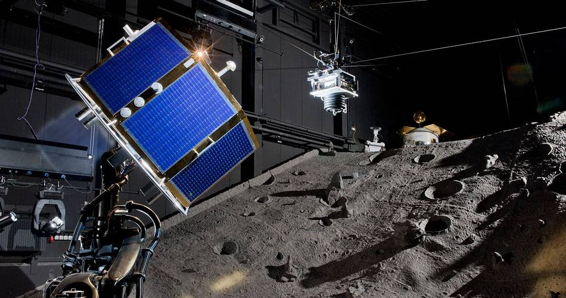

# Summary
Navigation of autonomous mobile robots is a complex problem which comprises of multiple software components, each performing a specific task, which when combined form the navigation software architecture. The ugv_nav4d is a path planner which can be used to navigate complex indoor and outdoor environments. It provides a traversable, motion constraint compliant, and collision free trajectory. It is highly customizable and can be used for any type of terrestrial robot.

To find a traversable trajectory, ugv_nav4d internally maintains a traversability map (TraversabilityMap3d) of the environment. The TraversabilityMap3d [1] is generated based on a multi-layered surface map (MLSMap [1]), which enables ugv_nav4d to plan trajectories in Multi-surface environments. The trajectory is composed by careful selection and piecing together of motion primitives from a pool of primitives. The primitives are generated based on the specific mechnical features of the robot. As a result, the planned trajectory always fits well with the motion capabilites of the robot. 

In short, ugv_nav4d

- can plan continuous, smooth, and feasible paths in complex indoor and outdoor environments
- can plan in Multi-surface environments, e.g. natural cave system, multi-storey buildings
- provides a complete trajectory for the planned path which is ready for execution
- provides a graphical user interface (GUI) for introspection and debugging

<figure>
  
  <figcaption>Figure 1: Planned trajectory in a multi-storey environment.</figcaption>
</figure>

# Statement of need
- General purpose path planner is needed which can support any type of terrestrial mobile robot system e.g. Differential Drive, Omni-directional, Ackermann Drive etc. 
- Capability to plan in a Multi-surface unstructured (e.g. natural cave system) and structured (e.g. office, garage) environments

# Software Components 
The core software components are 

- EnvironmentXYZTheta
- PathPlanner
- PreComputedMotions

### EnvironmentXYZTheta 
The core of ugv_nav4d is based on SBPL [2]. The environment in SBPL internally uses states and associated transition costs. ugv_nav4d uses the EnvironmentXYZTheta because this environment implements all interfaces needed by SBPL to enable ARA* based planning. A state in this environment consists of the position on the map (x,y,z) and the orientation of the robot (yaw). The EnvironmentXYZTheta uses TraversabilityGenerator3d [3] to generate a TraversabilityMap3d from a MLSMap. The TraversabilityGenerator3d classifies the MLSMap patches into traversable, non-traversable, and unknown terrain. The nodes in TraversabilityMap3d contains meta data of the ground surface (e.g., slope of the patch, supporting plane, etc.). 

<figure>
  
  <figcaption>Figure 2: TraversabilityMap3d generated by ugv_nav4d.</figcaption>
</figure>

`Traversable [Green]`: The robot can stand (with its center) on this patch in at least one orientation without hitting an obstacle. 

`Obstacle [Red]`: There robot will be in collision if it stands (with its center) on this patch. 

`Frontier [Blue]`: Borders to the end of the map.  

`Unknown [Purple]`: This is a virtual patch that serves as boundary for algorithms. This patch does not exist in the MLSMap. Patches also become unknown if there is not enough information in the MLSMap to be sure that a patch exists in this location.

<figure>
  
  <figcaption>Figure 3: The Moon Crater in the Space Hall at the RIC, DFKI [4].</figcaption>
</figure>

The EnvironmentXYZTheta is given the MLSMap of the Space Hall Crater shown in Figure 2 and the resulting TraversabilityMap3d generated by the TraversabilityGenerator3d is shown in Figure 3.

<figure>
  
  <figcaption>Figure 4: The TraversabilityMap3d of the Moon Crater in Figure 3.</figcaption>
</figure>

### PathPlanner
The SBPL provided ARA* planner uses a heuristic during the exploration for successor states. The heuristic is the time it would take the robot to follow the shortest path in between two states on the TraversabilityMap3d. Robot and terrain specific information used in the planning phase is: 

- the robot dimensions and orientations are parameters 
- collision checks with obstacles
- steepness of the terrain 
- motion primitives 

The planner generates a complete trajectory for the planned path and the trajectory can be executed by a trajectory follower [5]

<figure>
  
  <figcaption>Figure 5: The planned trajectory (yellow) using the robot [Hunter-SE](https://robotik.dfki-bremen.de/de/forschung/robotersysteme/hunterse) in the final demostration of the project [KIMMI-SF](https://robotik.dfki-bremen.de/de/forschung/projekte/kimmi-sf).</figcaption>
</figure>

### PreComputedMotions  
Motion primitives are a set of pre-defined motions which are stored as spline trajectories. Each primitive is a feasible movement of the robot from a given starting pose (x,y,z,yaw). The planner uses primitives to find candidate successor states from the start state. It samples the spline and confirms if the path followed along the spline is traversable and collision free. 

Upon motion generation, every motion is asigned a base cost.
The basic cost is when the robot would follow that motion on a horizontal flat surface. Factors for steepness and other penalties might be factored later during planning on a case to case basis.

Primitives are classified into four categories: 

- Forward Motion Primitive  
- Backward Motion Primitive  
- Lateral Motion Primitive  
- Point-Turn Motion Primitive 

<figure>
  
  <figcaption>Figure 6: A pool of forward motion primitives by the PreComputedMotions module.</figcaption>
</figure>

The user can adapt the planner for diverse types of ground mobile robots. A typical robot with an Ackermann drive will use forward and backward motion primitives. A differential drive robot can realize point-turn motions in addition to forward and backward motions. An omni-directional robot can realize all four motion types. 

All four primitive motion types are considered as valid motions. It needs to be mentioned that the point-turn primitives are a special case because they do not use a spline. On the contrary, forward, backward, and lateral motion primitives are splines. The basic shapes of the motion primitives are generated by the SbplSplineMotionPrimitives library [6].  

# Debugging and Unit Tests

### PlannerGui
A GUI is provided for introspection into ugv_nav4d for debugging and testing. Please see the planner parameter details in the ugv_nav4d repository. The PlannerGui is the main testing gui. It is designed to experiment with differen planner parameters on a static map. It can load point clouds from ply or serialized mls maps. A left click sets the start location, a right click sets the end location.

<figure>
  
  <figcaption>Figure 7: GUI for debugging and testing of ugv_nav4d.</figcaption>
</figure>

The MLSMap for the GUI can be a .PLY file or a PlannerDump. We provide PLY files for basic multi-surface test environments in the test_data folder of the ugv_nav4d repository. 

<figure>
  
  <figcaption>Figure 8: Visualization of a MLSMap generated from the test_area2.ply</figcaption>
</figure>

<figure>
  
  <figcaption>Figure 9: Visualization of the TraversabilityMap3d generated from the MLSMap in Figure 7</figcaption>
</figure>

<figure>
  
  <figcaption>Figure 10: Visualization of the planned trajectory based on the TraversabilityMap3d shown in Figure 9</figcaption>
</figure>

In case of error the Planner dumps its state to a file (this can be enabled using the dumpOnError parameter). The state can be loaded and analyzed using the ugv_nav4d_replay binary. This binary loads the state and executes the planning in a controlled environment. This can be used to debug the planner.

### Unit Tests
The unit tests for the planner are developed using GTest [7]. The following tests are implemented:

- Different resolutions for motion primitives and TraversabilityMap3d 
- Invalid goal pose (x,y,z,yaw)
- Invalid start pose of robot (x,y,z,yaw)
- Planning success

# Field Tests
ugv_nav4d has been used extensively in research projects for almost a decade. The planner has performed well in highly unstructured environments e.g. cave systems, outdoor rough terrains and in structured environments.

### Projects
Here we have listed some projects in which ugv_nav4d was used for autonomous navigation.

- [Entern](https://robotik.dfki-bremen.de/de/forschung/projekte/entern)
- [ANT](https://robotik.dfki-bremen.de/de/forschung/projekte/ant)
- [VIPE](https://robotik.dfki-bremen.de/de/forschung/projekte/vipe)
- [KIMMI-SF](https://robotik.dfki-bremen.de/de/forschung/projekte/kimmi-sf)
- [HiSE](https://robotik.dfki-bremen.de/de/forschung/projekte/hise)
- [PerSim](https://robotik.dfki-bremen.de/de/forschung/projekte/persim)
- [CoRobX](https://robotik.dfki-bremen.de/de/forschung/projekte/corob-x)

### Robots
ugv_nav4d is a very versatile planner and can be used for any type of a terrestrial robot. Below we have listed some of the many robots which use ugv_nav4d for autonomous navigation.

- [Artemis](https://robotik.dfki-bremen.de/de/forschung/robotersysteme/artemis)
- [Coyote-III](https://robotik.dfki-bremen.de/de/forschung/robotersysteme/coyote-iii)
- [Crex](https://robotik.dfki-bremen.de/de/forschung/robotersysteme/crex)
- [Charlie](https://robotik.dfki-bremen.de/de/forschung/robotersysteme/charlie)
- [Hunter-SE](https://robotik.dfki-bremen.de/de/forschung/robotersysteme/hunterse)
- [SherpaTT](https://robotik.dfki-bremen.de/de/forschung/robotersysteme/sherpatt)
- [Asguard-IV](https://robotik.dfki-bremen.de/de/forschung/robotersysteme/asguard-iv)

# Acknowledgements 
The ugv_nav4d library was initiated and is currently developed at the Robotics Innovation Center of the German Research Center for Artificial Intelligence (DFKI) in Bremen, together with the Robotics Group of the University of Bremen. The development was started in the scope of the Entern project (50RA1406), which has been funded by the German Aerospace Center (DLR) with funds from the German Federal Ministry for Economic Affairs and Climate Action (BMWK). 

# References
See paper.bib